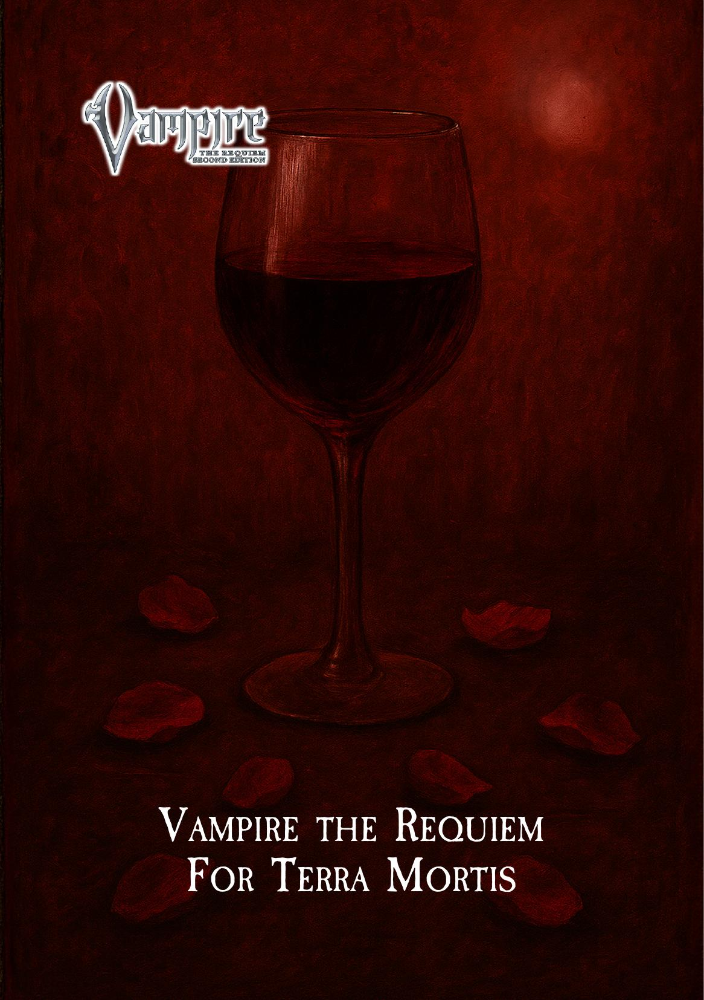
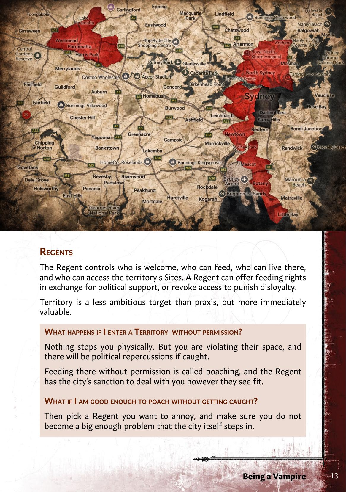
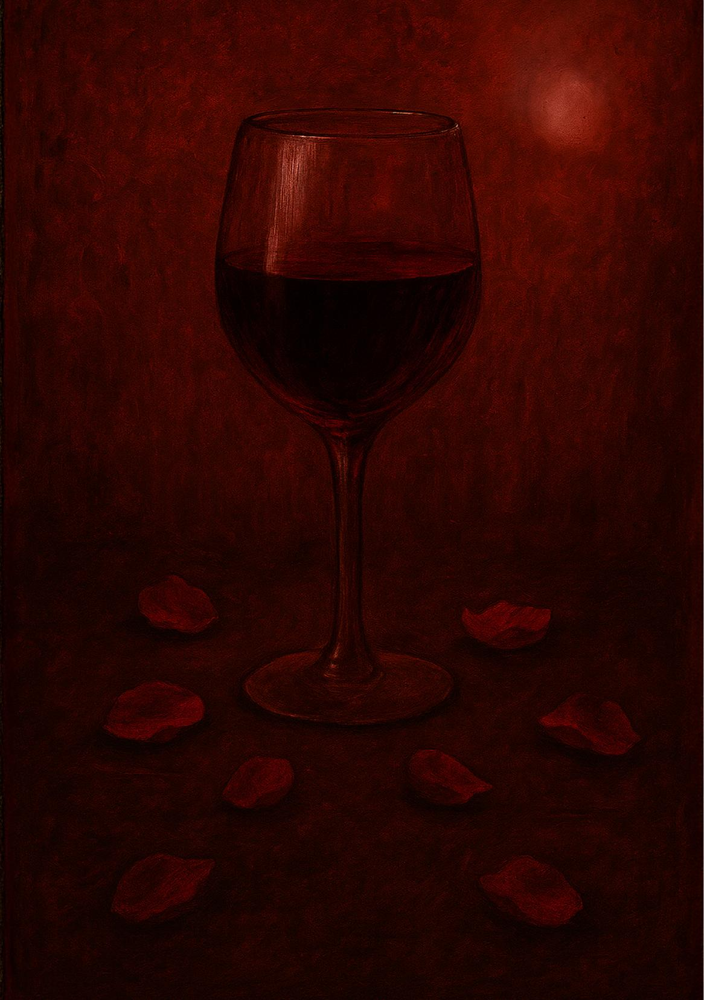

# Vampire: The Requiem — For Terra Mortis

---

## Terra Mortis Player Primer

Terra Mortis is a Vampire: The Requiem 2nd Edition LARP set in Sydney. This primer covers the lore, society, and rules of the All Night Society: the hidden world of the Kindred.

You do not need to read this document cover to cover before playing. It is a reference, designed so you can look up specific topics as they come up during play or character creation. Whether you want to understand how covenants work, what a Touchstone does, or how feeding mechanics operate, the relevant section is here when you need it.

---

## Contents

- **[Power Play](#power-play)** — 4
  - [Praxis](#praxis) — 6
  - [Territory](#territory) — 12
- **[Immortality](#immortality)** — 16
  - [Blood and Hunger](#blood-and-hunger) — 18
  - [Feeding Grounds](#feeding-grounds) — 20
  - [The Masquerade](#the-masquerade) — 22
- **[The Clans](#the-clans)** — 24
  - [Daeva](#daeva) — 26
  - [Gangrel](#gangrel) — 30
  - [Mekhet](#mekhet) — 34
  - [Nosferatu](#nosferatu) — 38
  - [Ventrue](#ventrue) — 42
- **[All Night Society](#all-night-society)** — 46
  - [Kindred Traditions](#kindred-traditions) — 48
  - [Hierarchy of the Damned](#hierarchy-of-the-damned) — 50
  - [The Currencies of Power](#the-currencies-of-power) — 52
- **[The Covenants](#the-covenants)** — 54
  - [The Carthian Movement](#the-carthian-movement) — 56
  - [The Circle of Crone](#the-circle-of-crone) — 60
  - [The Invictus](#the-invictus) — 64
  - [Lancea et Sanctum](#lancea-et-sanctum) — 68

---

# Power Play

## City of the Dead

Sydney lay empty of monsters for decades. A phenomenon known as the Dead Zone swept Australia clean of the undead, and the barrier held for the better part of a century. Now it has weakened, and you are here: one of the first vampires sent to stake a claim. Perhaps young enough to be expendable, ambitious enough to seize opportunity. Or an Elder, recently awakened from torpor, seeking a fresh start where old hierarchies hold no weight.

You are a monster hiding amongst six million mortals. By night you hunt for blood, build power, and compete with other vampires for control of the city. There are no established rulers, no recognised laws, no neutral ground. Just raw opportunity and fierce competition as multiple factions arrive simultaneously, all with the same goal.

Drama comes from city politics and personal relationships. Who rules Sydney, and under what system of government, is being decided by the players in this room. The bonds between individual vampires, the alliances and rivalries and debts, make those political struggles personal.

You and your rivals are building Sydney's vampire society from nothing whilst maintaining your disguise amongst the living. Tonight's ally is tomorrow's rival, and whoever claims domain, be it a democratic senate, a despotic prince, or a decadent council of oligarchs, will shape this new order for centuries to come.

---

## Playing a Vampire

### What This Means For You

**Court is the game.** You are playing a vampire who is politically invested. There are hundreds of vampires in Sydney, but you fought for a place in the inner circle. You have goals, ambitions, and needs. Court is where you pursue them. You arrive in character and stay in character. Three hours, once a month, of vampire politics conducted through conversation. Deals are made, claims are contested, alliances are formed and broken. Everything happens face to face.

**Court is where you gain power and where you go** to be entertained. You secure feeding rights, build your reputation, advance your faction's interests, and protect what you have. But eternity is long, and the company of other predators is the only real stimulation left. Some vampires come to Court to survive. Others come because they enjoy the game. Most come for both.

**Relationships are as valuable as raw political power.** Hard power comes from status, territory, and influence. Soft power comes from friendships, alliances, mutual debts, and shared history. Both are real, and both are useful. But this is a room full of predators, and every vampire wants more than they have. You can build genuine connections with other Kindred, but you cannot afford complacency. Trust without leverage is a vulnerability.

**The political landscape is entirely player-driven.** The structure of government itself can be challenged and changed. Vampire politics exist because the alternative is worse. Without rules, the strong prey on the weak.

**Status and territory are the two foundations of vampire politics.** Status is your political weight at Court. Territory is where the best feeding grounds are. It is not abundant, and you will compete over it, typically with allies at your side. Both are covered in detail later in this document.

**Nothing in Kindred politics is permanent.** The city is ruled by a regime, which vampires call a praxis: a generic term for who is in charge and how they rule. A praxis always serves someone's interests. It is typically a coalition that put one person in charge, in exchange for support. Regimes rise and fall. Today's ruler is tomorrow's exile.

---

## Praxis

Praxis is the system of government that rules the city. It could be a single Prince ruling by decree, a democratic senate, or a council of powerful elders.

Every praxis is autocratic. Even when a regime presents itself as democratic or collaborative, the Ruler defines its shape and can reclaim any power they delegate. A senate exists because the Ruler permits it. The moment that changes, the structure changes with it.

### How Praxis Forms

No single covenant, and rarely a single individual, is powerful enough to claim praxis alone. Praxis almost always comes from a coalition of interests across multiple covenants. The resulting regime reflects the agenda of whoever leads that coalition.

Status is the currency of these coalitions. Kindred with more Status carry more weight. You trade your backing for a seat at the table: positions of power, territorial concessions, and other favours.

### How Praxis Changes

Praxis changes when a challenger assembles enough backing to make a claim. This is not a vote and it is not a revolution. A handful of powerful Kindred backing a challenger can outweigh a larger group with less Status. In the fiction, this is vampires using their influence at Court to force the outcome they want.

When praxis changes, the regime typically changes with it. The new Ruler decides what the government looks like, though concessions may have been negotiated in exchange for support.

---

The Ruler's esteem of a vampire is the city's esteem. This is not a flaw in the system. It is the system.

The Ruler does not govern alone. To find the real power, look at who holds court positions and who appointed them.

### Head of State

The Ruler. They set the tone for the domain and have the greatest capacity to elevate or diminish other Kindred.

They can welcome newcomers into the city or cast someone out entirely by stripping their standing. Every other position exists at their pleasure.

> *Common titles include Prince, Archbishop, Oracle, and Premier.*

### Primogen

The most prominent Kindred outside the Ruler, determined by their combined clan and covenant standing rather than appointment. However, Primogen are not chosen by the populace and are not accountable to them. Their agendas are their own.

They can elevate or diminish others to a limited degree, and they stand apart as an informal counterweight to central authority.

### Socialites

Socialites shape reputation. Two typically exist. One is appointed by the Head of State and the Primogen, doubling the Ruler's reach over standing at Court. The other is established through popular support.

> *The names vary by covenant: Harpy, Tribune, Penitent, Trickster, Fool.*

### Enforcers

Enforcers maintain order. They are always appointed by the Head of State and charged with specific aspects of domain law, sacred spaces, or the Traditions. They can lower the City Status of anyone who breaches what they enforce, provided the breach has public support.

> *Common titles include Sheriff, Hound, Master of Elysium, and Constable.*

### Administrators

Administrators handle the bureaucratic machinery of the domain. They cannot shape Status directly, but they can block a change in City Status.

> *Common titles include Seneschal, Arbiter, and Keeper of Records.*

---

## City Status

City Status is your standing within the praxis. It tells every vampire in the room who they can and cannot afford to antagonise. When you try to impose your will on someone at Court, the gap in City Status between you matters. The bigger the gap in your favour, the easier it is. In the fiction, vampires do not refer to status as numbers. They use terms of address and social cues to signal importance. You will know who outranks you.

City Status can be **inherent**, meaning you have earned a reputation that affords you Status in your own right. It can also come from a **Position**. A Position grants additional Status on top of whatever you have earned personally. A Prince with a strong personal reputation carries more weight than one who relies on the title alone.

The Kindred who hold the levers of power decide your Status: the Head of State, the Primogen, and the Socialites. The most direct way to gain City Status is to be useful to the people who matter. Do something important for them, and they raise your Status in return. Public service to the city works too, but a well-placed favour is more efficient.

### Room at the Top

There are limits. The people in power need to justify your increase with recognised contributions to the city. Even when the real agenda is mutual back-scratching, the rationale has to hold up. If it does not, opponents are well within their rights to simply drop you back down.

There is also limited room at the top. The city can only support so many Kindred at each level of Status, and the higher you go, the fewer spots exist. Getting to the top means someone else is not there.

### How Does Status Change?

Significant changes to City Status are announced at Court. Minor shifts are handled more quietly, allowed to spread through conversation and rumour. Socialites are particularly useful for this, as the Head of State cannot be expected to make declarations over every small adjustment in Status.

---

## Sins Against the City

The following are widely recognised transgressions that justify stripping a Kindred's Status. They are not exhaustive, and context always matters, but these benchmarks give both accusers and defenders something concrete to argue from.

| Severity | Transgression |
|----------|--------------|
| **Severe** | Publicly defaming the city or its leadership. Killing mortals without justification. Intentionally breaking the Traditions. Blatantly raising or lowering someone's standing without credible rationale. |
| **Moderate** | Skipping required gatherings. Causing disruption at Court. Blocking access to key resources. Defying leaders publicly. |
| **Minor** | Unintentionally breaking the Traditions. Careless destruction that draws mortal attention. Aiding external threats through negligence. |

## Praiseworthy Deeds

The following are widely recognised contributions that justify elevating a Kindred's Status. As with sins, context matters, but those seeking elevation will be measured against these benchmarks.

| Severity | Contribution |
|----------|-------------|
| **Major** | Greatly expanding the city's power, resources, or reputation. Assuming a major leadership role. Eliminating a significant threat to the domain. |
| **Moderate** | Advancing the objectives of city leadership through strategic planning or exceptional service. Modestly increasing the city's resources or reputation. |
| **Minor** | Defending the city from external threats. Attending gatherings reliably. Consistently supporting the directives of city leadership. |

---

## Clan and Covenant Status

Clan and Covenant Status measure your standing within your own lineage and your own faction.

**Covenant Status is rank.** Covenants are politically organised, and your status represents how much authority and trust your faction has placed in you. It comes up often.

**Clan Status is prestige.** Clans do not typically organise politically, so clan standing is more personal. For some vampires, the distinctions of lineage and bloodline matter deeply. For others, not at all.

Your combined Clan and Covenant Status determines whether you qualify as Primogen, and both generate Influence, the political currency used to compete for territory and advance your goals at Court.

### Changing Status

Unlike City Status, which changes through official decree, Clan and Covenant Status change through the consensus of your peers. When enough of your faction believes your Status should change, it changes. This is not a formal vote. The Storytellers assess it based on the weight of opinion within your faction. Those with more Status carry more weight in that assessment.

Your Status rises when you embody your faction's ideals publicly, achieve victories that reflect well on the group, or gain recognition from faction leaders. It falls when your actions shame the faction or betray its principles.

> **Can I have more than one Covenant Status?**
> Yes, but it will cost you. You cannot have more than 5 Status across covenants combined, and you must have more in your primary covenant than in any other. More importantly, divided loyalty invites suspicion. Both sides will wonder where your real allegiance lies.

> **Can I have more than one Clan Status?**
> No. You can only have Clan status of your Clan.

---

## Playing for Status

A shift in status is more dangerous than fangs at the throat. It is the primary way vampires compete without resorting to violence.

### How to Climb

Every character begins with City Status 1 or 2. Getting beyond that requires being noticed by the right people. Public service and private favours both work. What matters is that you do something genuinely useful and make sure the right people notice.

### How to Tear Others Down

If you believe someone's Status is unearned, make the case. Go to a Socialite or the Head of State and argue that a rival does not deserve their position. Rally support. Present evidence. Campaigning to lower someone's status is one of the most effective political tools available to you.

### The Unwritten Rules

Everyone knows status is traded. Deals are struck and favours exchanged. This is accepted. However, pretence matters. You need a credible justification for any Status change. If the rationale is transparently hollow, that itself becomes grounds for someone to drop your Status. The corruption is open, but the appearance of legitimacy must be maintained.

> **Attendance Matters**
> Showing up builds status. Three consecutive sessions earns you City Status 2 if you do not already have it.
> Your Status may be affected by other players, even if you are not in attendance.

### Clan and Covenant Status

Playing for Clan and Covenant Status is less transactional and more about embodiment. Your faction needs to believe you represent them, both through service and through how convincingly you inhabit their values. There is no single lever to pull. Be the kind of Kindred your faction wants to elevate.

---

## Territory

Territory is survival. Without it, you are scrambling for blood every session. With it, you have security, resources, and political leverage. Claiming territory through Court is a social contract, a less destructive way to compete than open violence. They give you tools to undermine other players without tearing the city apart.

### Territories

A territory is an area of Sydney that has been cultivated for vampires to feed. Each one represents years of preparation by mortal and ghoul agents. Their safety makes them the most valuable commodity in the city.

**You are not confined to these territories.** You can move freely around Sydney, make a haven anywhere, and attempt to feed anywhere. But Sydney at large is not safe for Kindred.

The areas between territories are effectively lawless, potentially empty, or controlled by other monsters or worse. Simply passing through is unlikely to cause problems. You look like any other mortal. But feeding regularly, breaching the Masquerade, or doing anything that draws attention to what you actually are will have consequences.

**The CBD is an exclusion zone.** No vampire is permitted to claim control there. The elders who negotiated for territorial rights on your behalf have not fully explained why. You can still enter, but do not attempt to stake a haven or a claim here.

**Territories provide reliable, safe feeding grounds.** Additionally, each one contains **Sites**: specific mortal institutions such as police stations, hospitals, or nightclub strips. Sites generate Influence, and the Regent controls who can access them.

### Territory Map

### Regents

The Regent controls who is welcome, who can feed, who can live there, and who can access the territory's Sites. A Regent can offer feeding rights in exchange for political support, or revoke access to punish disloyalty.

Territory is a less ambitious target than praxis, but more immediately valuable.

> **What happens if I enter a Territory without permission?**
> Nothing stops you physically. But you are violating their space, and there will be political repercussions if caught.
> Feeding there without permission is called poaching, and the Regent has the city's sanction to deal with you however they see fit.

> **What if I am good enough to poach without getting caught?**
> Then pick a Regent you want to annoy, and make sure you do not become a big enough problem that the city itself steps in.

---

## Ambience

Every territory has an Ambience rating. This measures the wellbeing of the mortal population living there. Vampires drag locations down by their presence. As Ambience drops, the population becomes over-fed upon and demoralised. Blood from low-Ambience territories is thin and unsatisfying. Blood from high-Ambience territories is rich and nourishing.

Regents and residents improve Ambience through downtime actions, spending Influence, or using mortal connections. Neglect it and it slides back towards squalor. Holding territory is not passive. It demands ongoing attention.

A territory's Ambience affects how much blood you start each session with, how much Influence the territory's Sites generate, and your effective Status at Court.

### Feeding and Territory

Your feeding grounds determine how much blood you start each session with. Access to a well-maintained territory with high Ambience means you arrive fed and ready. A neglected territory means you start with less.

No access at all means you are a vagrant. Vagrants suffer a steep penalty to their starting blood, cannot build established feeding grounds, and are reduced to poaching in territories where they have no rights. You can survive without territory, but you will always be at a disadvantage.

---

## Claiming a District

Any vampire with City Status 2 or higher can make a claim to a territory while Court is open. Your claim must be seconded by another vampire of at least the same Status.

> *The Storytellers may waive these requirements, particularly at the start of a new game or when a territory has no current Regent.*

Once a claim is declared, other parties can declare competing interest in the same territory. Each requires their own second.

### The Bidding Process

**Declaration.** A vampire announces their claim to the Ruler during the opening of the Court. The challenge is posted publicly at Court.

**The Blind Bid.** The challenge becomes a shadow war of negotiation. Players secretly commit Influence to their chosen side by placing tokens into the relevant box. No one knows the current tallies. Whispered deals, last-minute betrayals, and desperate attempts to rally support.

**Final Commitments.** Thirty minutes before Court ends, the Ruler calls for final commitments. Last chance to place tokens before bids close.

**The Ruler's Peek.** Before the tallies are revealed, the Ruler may look into the boxes and transfer a small number of tokens between sides.

**Resolution.** Totals are revealed. The current Regent has an advantage when defending. Ties are broken by the Ruler's decision. Everyone who backed the losing side loses what they spent. The winner becomes Regent.

> **Why can't I just take a Territory by force?**
> You can try. But you are stepping outside the protections of the city, and you will get whatever is coming to you.

---

# Immortality

## On Being a Vampire

You are a creature of the night, once human. Someone cheated death to bring you back, and now you carry the consequences. You might devote yourself to faith and good works, play philanthropist, play hero. Or you might accept what you are and embrace it. Likely a bit of both.

### What You Are

**You drink blood.** This is not optional. Feeding is intense for both predator and prey. The blood sustains you, lets you wake each night and use your supernatural abilities. Without it, you fall into torpor, a deathlike sleep that can last decades.

**You are nearly immortal.** Very little can harm you. Sunlight burns. Fire destroys. A wooden stake through the heart paralyses you. Decapitation whilst staked ends you permanently. Beyond that, the years stretch out indefinitely. Wounds that would kill mortals are inconveniences. You heal by spending stolen blood.

**You have terrifying powers.** Supernatural speed, impossible strength, mental domination, shapeshifting. These abilities are called Disciplines. They cost blood to activate but make you far more than human.

**You don't appear in photos or mirrors.** Not quite true. You appear in mirrors naturally. Recorded imagery is harder: something always goes wrong, but it's instinct, not magic. A defence mechanism worn into existence through accumulated lies.

### The Weight of Years

Immortality delivers exactly what it promises: existence without end, persistence without purpose.

Time changes you. Not through ageing but through accumulation. You collect experiences like sediment, layer upon layer, until the weight threatens to bury whoever you once were. Mortal concerns fade. What matters to someone who lives seventy years means nothing to someone who has lived seven hundred.

The mortal world keeps moving whilst you stand still. Friends age and die. Buildings are demolished. Cities transform. Languages evolve. Technology leaps forward. Each time you wake from a long sleep, the world has moved further beyond your understanding. Some vampires anchor themselves to their era, clinging to rituals and behaviours from their mortal days. These anachronisms aren't affectations but psychological necessities, reminders that a time existed before the curse.

The oldest vampires view younger Kindred as barely individuals. When you've watched the same dramas play ten thousand times with different faces, when you've seen every permutation of mortal joy and suffering, people cease being people. They become patterns, resources, obstacles.

Immortality isn't a gift. It's arithmetic. With each multiplication of years comes division: of humanity, of connection, of meaning. Yet vampires persist because Final Death remains the only greater fear.

### The Price of Immortality

Your immortality is not freedom. Dawn compels you to sleep whether you wish it or not. Fighting this pull is exhausting and futile. Waking is traumatic: your body seizes, limbs paralysed before tingling back to unlife. Only fire or sunlight can rouse you during the day, and then only for desperate moments of escape. You are at your most vulnerable whilst the sun is up, helpless in your haven, dependent on others to protect you.

When blood runs out or injuries overwhelm you, torpor claims you. Your body desiccates, skin tightening and turning ashen whilst your mind wanders through nonsensical dreams. Time passes without your awareness or consent. A wooden stake through the heart forces immediate torpor, and you remain paralysed until someone removes it. Vampires have been discovered centuries later, still transfixed, waiting. When you finally wake, everything you knew may be dust.

---

## Blood and Hunger

You are a predator. You hunt, you feed, or you die.

### Blood

Blood is everything. Your body craves it with unnatural intensity. As a predator, you are finely attuned to the scent of it, the sound of it pulsing through living veins. Blood is the closest thing you have to food, but your body doesn't metabolise it for energy. Instead, you convert it into Vitae, a supernatural ichor that animates your dead flesh, rouses you each night, and fuels your preternatural abilities.

Your hunger is more urgent than any mortal need. Humans can survive weeks without food. You have nights, perhaps a week if you ration carefully. When your Vitae runs dry, you collapse into torpor. The hunger never truly leaves. Even freshly fed, you know it will return.

### Hunger

Inside you lives something else: the Beast. It is the predatory instinct made manifest, the part of you that is pure hunger and violence. The Beast doesn't think or plan. It only wants. It screams for blood, demands satisfaction, gives you the desperation and strength to take what you need.

When the hunger grows too intense, the Beast can overwhelm you completely. You lose control. Your human consciousness retreats whilst something older and more primal takes over. This is called frenzy. In frenzy, you hunt without thought, feed without restraint, kill without hesitation. You become what mortals fear when they imagine vampires: a mindless predator driven only by hunger.

The Beast protects you from starvation and threats, but it extracts a price. Every time it surfaces, every time you let it drive, you lose something human. The hunger is always there, and the Beast is always waiting for you to weaken, always ready to take control when your reserves run low or your emotions run too high.

### Sources of Blood

Many sources of blood exist for the predatory Kindred. Animals offer the easiest prey: stray cats and dogs, rats, pigeons. They are simple to hunt and pose no threat. But animal blood is barely satisfying, weak sustenance that leaves the hunger gnawing. Most vampires who attempt to survive on animals eventually supplement with human blood.

Humans are the primary prey. Some vampires even feed on other Kindred. This is dangerous and often taboo, but for some it becomes the only option.

### Feeding on the Kine

Mortals are food. Kindred can dress this up with philosophy, justify it with necessity, but the truth remains: humans exist to be consumed. Every interaction with mortals carries this tension. The vampire talking to their neighbour is also calculating how much blood they carry, whether they would notice one more feeding, how easily they could be isolated.

This predatory nature shapes everything. Vampires develop preferences like gourmets. Some prefer the blood of the young, others the aged. Some hunt the healthy and athletic, others the drunk or drug-addled. The blood of the fearful tastes different from the willing. Artists, priests, criminals: each carries their own flavour. Every vampire has favourites.

### Feeding on Kindred

Vampire blood is different. It is potent in ways mortal blood can never be, concentrated with supernatural power. It is also highly addictive, even to other vampires. One taste and you understand why some Kindred become obsessed with it.

Feeding on other vampires is often taboo, seen as violation or assault amongst Kindred society. The victim will remember, will likely retaliate. But more than social consequences, vampire blood creates dependencies. Three drinks and you become bound to the one who fed you, enslaved by blood more surely than any chains.

For the oldest vampires, feeding on Kindred becomes necessity rather than choice. Their blood grows so potent that mortal vitae provides nothing. They must hunt other predators to survive. This creates the fundamental tension of vampire society: elders need younger vampires to exist, yet must keep them weak enough to prey upon.

---

## Feeding Grounds

Your fangs normally retract, appearing only slightly sharper than human canines. At will, you can extend them fully to bite and feed.

The Kiss is how most vampires feed. Your bite creates intense euphoria in the victim, pleasure so overwhelming it distracts from the reality of what's happening. Many vampires use this as part of seduction, mixing predation with intimacy. The victim emerges with hazy memories and a pleasant, dreamy afterglow. You can seal the wound by licking it, leaving no visible trace. The Kiss blurs boundaries between predator and prey, a moment where both experience overwhelming sensation. The victim's will weakens with repeated feeding, making them increasingly susceptible to your influence.

But feeding can also be violent and traumatic. Perhaps you lost control. Perhaps you were wantonly savage. Your fangs become weapons. You attack, bite, drain. The victim is left scarred, traumatised, bearing the marks of violence. This method is effective when hunting dangerous prey or feeding in combat, but it draws attention. Wounds are obvious. Trauma is memorable. The Masquerade becomes harder to maintain.

### Hunting Strategies

The Beast demands blood, but the human mind must devise methods to obtain it. How you feed reveals what kind of monster you choose to be.

> *Feeding on stray animals, telling yourself this is sustainable. The easiest person to con is yourself. Maybe just a few drops of human blood would ease the ache.*

> *Haunting elderly homes, in long conversations with the lonely. At 3am, when you know them well enough that it hurts, you feed. It has to hurt going down.*

> *Working as an EMT on night shift. Your vehicle drives in the space between society and the dead, exactly where your kind belongs. Meals on wheels, delivering to yourself.*

> *Working as an exotic dancer. Nobody refuses the back room special. The money is good, and they always tip more after the Kiss.*

### Territory and Territoriality

Every vampire needs hunting grounds. Territory is more than a feeding area: it becomes identity. Most vampires claim specific locations where they know the rhythms, the escape routes, the patterns of mortal life. These might be nightclubs, university campuses, hospitals, homeless shelters, entertainment districts. The territory provides reliable access to prey whilst the vampire's presence offers a degree of protection and control.

Territory becomes personal. The vampire shapes their hunting ground through repeated feeding, and the hunting ground shapes them in return. Other vampires recognise these claimed spaces through instinct and observation. Encroaching on another's territory is provocation, sometimes justification for violence.

Most vampires rotate between multiple hunting grounds to avoid detection. But some claim territories and refuse to leave, feeding in the same locations for years or decades. These vampires become deeply entwined with their domains, for better or worse.

### Contamination

You are what you eat, literally. Feed regularly from a type of community and you start to carry their manners. Short-term effects pass, but long-term feeding patterns reshape identity completely. The contamination flows both ways. Where vampires hunt regularly, the territory itself changes. Areas develop atmospheric unease that mortals cannot quite name but instinctively feel.

> *Feed regularly from drug addicts, and you carry their highs and lows. Feed from the devout, and you unconsciously adopt their mannerisms. Feed only on the desperate, and you become desperate yourself. Feed only on the wealthy, and you start thinking of everything in terms of transactions and assets, including human lives.*

> *An ancient vampire dwells in New York, speaking with the accents and adopting the culture of those she feeds upon. Renaissance France, once vivid in memory, fades beneath layers of accumulated blood.*

> *A Nosferatu inhabits a shopping centre. The children's restaurant grows increasingly sinister. Adults dismiss the grotesque animatronic band, throwing generations of screaming children to the clowns. The children cannot ignore it.*

---

## The Masquerade

Vampires are animated corpses, frozen at the moment of their Embrace. Hearts that don't beat, lungs that don't breathe, bodies that don't age. Without conscious effort, they appear as preserved dead things moving through a world of the living.

The Masquerade is more than hiding fangs or avoiding sunlight: it's the performance of being alive. Every interaction requires deliberate deception: forcing warmth into dead flesh, remembering to blink, mimicking breath. Over time, predators perfect this ruse. The performance becomes second nature, reflexive rather than conscious. The smallest slip still reveals the walking corpse beneath, but slips become rarer with practice.

### Two Truths

Every Kindred maintains a duality: the lie they show the world and the truth that gnaws within.

The public facade is the pretty lie, the excuse for never staying for breakfast, the reason for barely touching dinner. It's vulnerability weaponised as protection. Defending this facade means defending existence itself: revelation means death. But it's also a lie vampires tell themselves, a way to subsume themselves in humanity and forget, however briefly, that they are monsters. The performance isn't just for mortals: it's for the vampire as well.

The private truth is darker. Vampires are solitary predators by nature, yet they retain trappings of humanity: the ache of loneliness, the desire for connection. They cannot reveal themselves to mortals for companionship. They cannot trust other Kindred, who are rivals and potential predators. In a society where everything is performance, this isolation is the only honesty. It's who they are when the lights go out and nobody watches.

### Living the Double Life

Vampires walk among mortals as wolves in sheep's clothing. Humanity serves as both food and false companion. This proximity is dangerous but necessary: too distant and the vampire becomes obviously alien, too close and the predator's nature reveals itself.

Human society constantly evolves whilst vampires remain static. Some adapt, learning each generation's patterns and quirks. Others cling to their era, becoming increasingly anachronistic. Speech patterns mark them as out of time. References betray their age. They've seen these patterns before: different faces, same stories, same endings.

Vampires are walking corpses. By default they appear pallid, dead, more so as they age. But they can counterfeit life, using blood to falsify living flesh. Vitae forces dead hearts to beat, lungs to breathe, skin to warm, allowing them to eat food, make love, cry real tears. But it's expensive, draining precious blood for mere hours of pretence. Some become addicted to the sensation. Others refuse it, finding the reminder unbearable.

The Beast within them is a practised deceiver. Even in the age of recordings, vampires hide. A vampire does not lack a reflection, but you never quite see her in the mirror. She knows precisely where to stand. Vampires aren't blurred in photographs, but somehow never look at the camera. The flash smears the image. The exposure goes wrong. These aren't supernatural effects but instinctive deceptions: the body lying as expertly as the mouth.

The modern world offers advantages: video calls hide corpse-cold touch, night work is normalised, dating apps provide easy feeding. They work night shifts, freelance schedules, artistic pursuits. They maintain Instagram accounts photographed exclusively at night. They cultivate feeding grounds where their presence seems natural: nightclubs where nobody questions cold touch, hospitals where odd schedules are expected, entertainment districts where eccentricity is currency.

Every vampire develops their methods. Some become recluses, minimising contact. Others immerse themselves completely, surrounding themselves with humans to force constant performance. Most find a balance: close enough to feed and maintain the illusion of humanity, distant enough to hide what they truly are.

---

# The Clans

## Blood and Lineage

Our blood runs in five cursed lines, damnation passed from sire to childe. Each filling a role: the seducer, the survivor, the voyeur, the nightmare, the master. Some say we were once one, children of a Mother of Monsters who diverged through centuries. Others believe the curse exists in all humanity; scratch anyone deep enough and you reveal the Beast inside.

We are many kinds of monster. But we are all Kindred, for we were once human.

### The Five Clans

A clan is a vampiric lineage, mystical commonalities inherited through the Embrace. When a vampire creates progeny, the childe shares their sire's clan. These characteristics are immutable; a vampire can never change their clan.

- **Daeva:** The seducers who embody desire and excess. Their curse binds them to those they feed upon, becoming obsessed with their prey.
- **Gangrel:** The survivors who embrace their feral nature. Their curse makes the Beast harder to control, threatening to overwhelm their humanity.
- **Mekhet:** The shadows who see what others miss. Their curse makes them more vulnerable to vampire weaknesses, especially sunlight and fire.
- **Nosferatu:** The nightmares who inspire instinctive fear. Their curse makes them repulsive to mortals, whether physically monstrous or disturbing.
- **Ventrue:** The lords who rule through dominance. Their curse is emotional detachment, as power isolates them from those they command.

### Bloodlines

Whilst all Kindred belong to clans, sometimes the blood twists into something different. Bloodlines are sub-families that shift the vampiric condition towards specific abnormalities. They gain a fourth inherent Discipline beyond their parent clan's three, often developing unique Devotions and powers unknown to mainstream Kindred.

All bloodlines carry an additional curse beyond their parent clan's weakness. Some bloodlines trace their origins to antiquity, whilst others emerged recently from ambitious elders seeking to leave their mark on eternity.

A vampire can belong to only one bloodline and cannot leave once joined.

#### Joining a Bloodline

A vampire must choose to join a bloodline through a deliberate ritual. If joining their sire's bloodline, they drink from their sire. If joining a different bloodline, they require an Avus: a bloodline mentor who sponsors them into the line. The process permanently alters the vampire's blood, adding the bloodline's gifts and curses.

The drinking required for joining always risks addiction and blood bonds. When an Avus sponsors an outsider, the relationship becomes more complex. The Avus effectively adopts the vampire into the bloodline, revealing secrets and knowledge that could be turned against them. This creates vulnerability beyond the blood itself.

The relationship between Avus and initiate often persists long after the transformation. The Avus holds power over their student's entry into a new family, knowing they offer something irreversible. Some demand years of service before agreeing. Others test potential members through ordeals that prove commitment.

---

## Daeva

### The Ones You Die For

The Daeva are social predators. Where other clans hide, the Daeva wear what mortals already want: beauty, charisma, status. They don't need to chase their prey. People come to them willingly.

Their method is exploitation of desire. A Daeva finds what you want and gives it to you. A shoulder to cry on, a night you'll never forget, the validation you've been starving for. All they ask in return is your throat. That's the real horror of the Daeva. They don't trick you into something you don't want. They give you exactly what you want, and that's worse.

They've adapted through the ages. In the ancient world they were temple gods, fed by worship and sacred prostitution. When monotheism changed the rules, they became demons, succubi and incubi. Tonight, they are zeitgeists. They embody whatever the culture craves: celebrity, influence, the curated image. They are the walking embodiment of "I'll resist tomorrow."

In practice, the Daeva are fast, strong, and supernaturally charming. They move through mortal society like they own it, because in many ways they do. They get invited to the best parties, they lead cults of personality, and they pull people apart when charm fails.

But the Daeva are broken by their own nature. They chase sensation the way addicts chase a high. Blood, sex, experience, anything that makes them feel alive. The problem is that it works, briefly, and then it doesn't. The hole gets wider every time they fill it. They can never stop, because stopping means confronting what they've lost. They pursue the things that simulate life at the expense of the things that once gave life meaning.

Gods should not envy the worshippers.

### Clan Origins

Like all clans, the Daeva have no confirmed origin. Vampires tell stories, and none of them agree.

Some say the Serpents descend from Lilith, the handmaiden of Inanna, who was murdered by the goddess and ransomed back from the underworld. The deal may have been a trick. The owls of the dead are still owed a debt.

Others point to the Dancing Plague that swept through Europe for centuries. Victims danced for days until their hearts gave out or their ribs broke. Some never stopped. In a monastery outside Strasbourg, a woman has been dancing since 1518.

The oldest fairy tale version is simpler. A princess had her heart cut out and eaten. She rose the next night, and every night after, consumed by the need to fill the void in her chest.

- **Nickname:** Serpents
- **Clan Bane (The Wanton Curse):** The Daeva taste the romance in all things, but none so much as blood. Mortals are not just food. They are an obsession, and that fixation grows with every sip. The Daeva fall to hunger more easily than other clans, and feeding from the same mortal twice risks becoming emotionally dependent on the vessel. *(Note: The Daeva Curse has been modified for Terra Mortis.)*
- **Favoured Attributes:** Dexterity or Manipulation
- **Disciplines:** Celerity, *Majesty*, Vigour

#### Stereotypes

- ♦ **Gangrel:** "It's so precious, how relentlessly they chase the prey. Must be exhausting."
- ♦ **Mekhet:** "They call us shallow. We call them concave."
- ♦ **Nosferatu:** "All in all, I have to think that strumming love is more cruel than tickling fear."
- ♦ **Ventrue:** "Give them a series of puerile achievements to attain, and they'll actually think they're winning."

### How to Make a Monster

Whatever a Daeva pursues, they pursue hard. That pursuit is often social, but it can just as easily be physical or intellectual. Regardless, it will require an audience. A Serpent doesn't need to be overtly social, but they will need eyes on them. The aloof, puzzle-solving genius still needs that genius recognised. More than any other clan, the Daeva need a feedback loop. They thrive in the crush of humanity and are not so graceful in a vacuum.

They keep sharp with mortals, and they rarely lose the Man to the Beast through isolation. They are the clan most likely to cultivate Empathy. But that understanding of the damage they cause is itself a road to the Beast.

Many Daeva cultivate striking appearances, and unlike most dead predators, they function best when seen. Through Majesty, even plain clothes become glamorous and weatherworn garb becomes effortlessly cool. Some stop caring about their appearance entirely, and somehow that makes them more attractive. You can often spot a Daeva by the way they move. They are always moving. Even the clumsiest mortal gains a sinuous grace as a Serpent.

#### Character Building Advice

- ♦ Social Skills are rarely a Daeva's weakest category.
- ♦ Pay attention to Skill Specialities. One of those is likely what attracted your character's sire, and the backstory of that relationship can grow from that single trait.
- ♦ If your character leans heavily on Majesty, you'll want Presence and Manipulation, along with Empathy.
- ♦ Celerity needs no specific build choices, but Vigour's effects benefit from Strength.

#### In the Carthian Movement

The Daeva are the mouths of the Revolution. Their tongues turn ideology into contagion and stoke mobs into wildfire. The Serpents are the recruiters, and the Firebrands of other clans know you need at least one Daeva around.

> Play a Carthian Daeva if you want to be the charismatic face of a political movement. Recruitment, rabble-rousing, turning a crowd.

#### In the Circle of the Crone

Some of the most important voices in the Crone's choir belong to the Serpents. A wise hierophant keeps them close. The Daeva's presence makes rituals grander, the spirituality more real, the air of a wild hunt more tangible. It's easier to believe.

> Play a Crone Daeva if you want to be the spiritual centre of something wild. Rituals, ecstatic worship, being the one who makes everyone else believe.

#### In the Invictus

The Daeva function well in the middle of a web. They know just how to pluck the strands. Their grandeur adds an air of legitimacy to the courtly behaviour of the First Estate, making it all a better misdirection for the blackmail and backstabbing behind the velvet curtains.

> Play an Invictus Daeva if you want to play courtly politics from the middle of the web. Manipulation, misdirection, making power look beautiful.

#### In the Lancea et Sanctum

The immortal passions of the Daeva can bend into religious ecstasy of a frightful intensity. Their sermons wash over the laity like a tidal wave. They know the exact point where divinity and perversion meet, and they know the sinners intimately.

> Play a Sanctified Daeva if you want to weaponise passion as religious fervour. Preaching, temptation, knowing exactly where the line between holy and profane sits.

---

## Gangrel

### The Ones You Can't Kill

The Gangrel are ultimate survivors. Close to the Beast and close to the bone, they are feral in the truest sense. They shrug off terrible wounds. They go where other monsters fear to tread. They lope on four feet, fly on dark wings, dissolve into ravenous smoke. You cannot escape them, and you cannot stop them.

Where other clans need havens, audiences, institutions, or secrets, the Gangrel just take what they want. Everything they need is locked away in the endless potential of their own monstrous flesh. Power without guilt. Lust without doubt. While the rest of the Kindred wrestle with esoteric riddles of what it means to be a monster, the Gangrel offer something more pure.

They don't have a neat history. Their past lives in oral tradition, fragments scratched into ancient stone and scrawled on alley walls. They make more bogeymen per capita than any other clan, and they wear that reputation like a pelt. The Gangrel are the voice in the bog, the thirsty earth, and the reason humanity discovered fire.

Don't mistake feral for simple. A Gangrel can be a storyteller drifting from town to town collecting folklore, piecing together the locations of slumbering ancients. A Gangrel can be a CEO who rules a corporate skyscraper floor by floor, marking territory in blood, sloughing off ruined suits like a moulting animal. A Gangrel can be something ancient and patient lurking beneath a lake, drawing swimmers down with a glassy-eyed hunger they're too embarrassed to name. The predator adapts to its environment.

But the cost is your sense of self. Surrendering to the Beast, or even just using it the way the Gangrel do, means giving up pieces of who you are to your inner hungers. Their bodies change: grotesque claws, alien forms, shapes that are no longer their own. It's not only in their minds but swimming under their skins. There is no escape from the Beast. Not for their prey, and certainly not for themselves.

### Clan Origins

Like all clans, the Gangrel have no confirmed origin. Their history lives in fragments and oral tradition, and none of the stories agree.

Some invoke Ekhidna, the Mother of Monsters. All the world is her womb, and all her children are embryonic predators devouring one another in the dark. Whatever survives grows into the next lifecycle.

Others tell of barbarians in the wastes beyond Rome who lay with savage gods. Their bestial offspring craved blood, and one fed upon a Ventrue lord. The lord's blood debased the creature into something new: a feral Kindred of a kind.

The oldest stories speak of bogs with deep memories. Something prehistoric travelled thousands of miles in a glacier, waited in dark water, and urged ancient men to throw sacrifices into its mouth. The first bog body tore through the earth, preserved and changed. Only death can nourish it.

The fairy tale version tells of a huntsman who failed his queen and lay down in the woods to die. Woodland creatures gnawed his flesh. The soil took his bones. Many nights later, the ground spat him back up. When his descendants call, the animals answer, for each carries a tiny piece of the ancient in its belly.

- **Nickname:** Savages
- **Clan Bane (The Feral Curse):** The Beast coils lethargically under the skin of most Kindred. But the Gangrel and the Beast are thick as thieves. It rises and rips out of them to protect them from the world, but it has a price. It's harder to resist the Beast's call, and harder still to remember why you should even want to.
- **Favoured Attributes:** Composure or Stamina
- **Disciplines:** Animalism, *Protean*, Resilience

#### Stereotypes

- ♦ **Daeva:** "Watch the peacock eat its own wings to make itself tame."
- ♦ **Mekhet:** "The shivering Shadows are always watching. So we just ramble to places they fear to go."
- ♦ **Nosferatu:** "The abandoned, half-finished sculptures of a lazy Beast."
- ♦ **Ventrue:** "Heya, little brother. Did you know that you'll last only as long as their termite towers? That'd make me nervous, staring down the mouth of forever."

### How to Make a Monster

All Gangrel are survivors. Those who aren't quickly change, or litter the earth with their ash. But not all Gangrel are alphas. Some saunter down the street as the dog with the biggest bite. Some creep and hide as scavengers. Some shift and blend like chameleons. Many go through several phases across the lifecycle of their Requiem.

A Savage is moulded by their environment. Some survive on growl and bluster. A clever coyote of a Gangrel relies on sharp wits, stealth, and larceny. Some latch onto more powerful monsters like remoras, flattering fiends to stay close to power. Some quickly abandon their Humanity to become better predators. Others practise human mimicry down to an art, for exactly the same reason.

More than any other clan, the Gangrel's Beast expresses itself physically. Through Protean, that expression is unique from Savage to Savage. What is your Beast like? Cold and reptilian? An aquatic predator like a shark or leopard seal? At home underground like a rat, or comfortable at great heights like a bird of prey? It might rage like a wolf, cackle like a hyena, or be a chimera of several creatures. Decide the flavour of your Beast and work with the Storytellers on how to manifest it through Protean. When not using their shapeshifting powers, what behaviours does your character betray that subtly communicate this Beast?

#### Character Building Advice

- ♦ The stereotypical Gangrel loads up on Physical Attributes and Skills, with plenty of Stamina, Survival, and Brawl. But there's room for variation.
- ♦ A bluster-focused Savage might take Social Attributes as primary and lean into Intimidation. A cunning one might prioritise Mental Attributes with Stealth and Larceny. A political survivor might invest in Manipulation and Persuasion.
- ♦ If your character leans heavily on Animalism, you'll want Manipulation and Animal Ken to start, adding Presence and Intimidation as they mature.

#### In the Carthian Movement

> Play a Carthian Gangrel if you want to be the muscle and momentum of revolution. The one who can't be pinned down, can't be threatened, and carries the message city to city.

#### In the Circle of the Crone

> Play a Crone Gangrel if you want to explore what it means to be a monster through primal magic. Wild Hunts, beast wisdom, and a deep connection to something ancient.

#### In the Invictus

> Play an Invictus Gangrel if you want to be the predator who learned to play politics. The knight, the hound, or the one who clawed their way to savage nobility.

#### In the Lancea et Sanctum

> Play a Sanctified Gangrel if you want to be God's attack dog. Faith channelled through the Beast, relics hunted in places no one else dares go, and a terrifying kind of holiness.

---

## Mekhet

### The Ones You Don't See

The Mekhet are spies, prophets, and watchers. They go where they will and learn what they want. No secret is safe from them. They are quiet, invisible, and yet they see everything. In their hollowed-out insides, there is an event horizon that swallows light, sound, and all knowing. The Shadows gravitate to certain manias: the occult, puzzles, prophecy, symbolism, esoterica. Even a cement-footed klutz in life finds that after the Mekhet Embrace, people say things like, "Oh! I didn't see you there."

Stories echo out of ancient Egypt, of secret cults and walking cadavers with dissected souls. The Cherokee named the silence ka'lanu ahkyeli'ski, the Raven Mockers, who devoured the remaining years of the sick, unseen in the same room. In the age of information, the Mekhet curse creeps along whole new vectors. A stage magician performs for audiences that find him only by cryptic flyers. A bookshop clerk guards a secret room behind the right combination of syllables. A private investigator you will never meet operates only through a secretary whose breath reeks of syrupy copper.

Let the other clans tromp through their Requiems like drunk elephants. No one will know exactly what the Mekhet are doing. They go anywhere, see anything, know it all. They are watching you sleep. They find your breathing quite beautiful. They dropped the hint that exposed your affair. They know the thing you sit up at night praying no one ever finds out.

But to know everything is to carry the burden of terrible truths. The Mekhet become something less by hiding. Identity loses all context when no one can see you. Knowing everyone's secrets means knowing some very bad things. For the Mekhet, there are no masks. Ignorance was bliss.

### Clan Origins

Like all clans, the Mekhet have no confirmed origin. Their stories are older and stranger than most.

One tells of the witch-king Akhenaten, who married a hollow thing from outside day or night. He built an army of hollow soldiers and tore down the old gods. But the Cult of Set was cunning. Their priests removed their own souls so no demon could devour them. They rose after death and defeated Akhenaten, but did not understand the price of what they had done.

Another speaks of explorers who sailed into the land of the dead. There was no sun, no stars, and torches would not light. They paid the underworld shades for directions in blood, a cup a question, until they had none left. They returned to the land of the living, but not all the way. They brought back secrets and an unquenchable thirst.

The fairy tale version is simpler. A witch consumed by envy looked into her magic mirror, and it devoured her reflection. Her scattered progeny still slink about in the gloom, obsessed with secrets, fearful of mirrors, searching for something they've forgotten.

- **Nickname:** Shadows
- **Clan Bane (The Tenebrous Curse):** Vampire weaknesses cut deeper into the Mekhet than any other clan. Sunlight, fire, and torpor pull at them with a stronger tide. Each Shadow also carries an additional bane, a personal vulnerability unique to them. *(Note: The Mekhet bane has been modified for Terra Mortis.)*
- **Favoured Attributes:** Intelligence or Wits
- **Disciplines:** *Auspex*, Celerity, Obfuscate

#### Stereotypes

- ♦ **Daeva:** "Suffering unnatural lust towards a Serpent? Just look into her soul. Clears that right up."
- ♦ **Gangrel:** "The Man and the Beast are having an amiable picnic in that Savage's head. It's rather disturbing."
- ♦ **Nosferatu:** "You look how the Daeva feel."
- ♦ **Ventrue:** "Those with the most schemes are always the most nervous when we walk into a room."

### How to Make a Monster

Even a cement-footed klutz in life finds that after the Embrace, people say things like, "Oh! I didn't see you there." Shadows compulsively gravitate to certain manias: the occult, academia, puzzle solving, prophecy, weird art, symbolism, esoterica.

Appearance varies wildly from Shadow to Shadow. Some dress professionally. Others wear lots of black. Some subconsciously dress more and more unremarkably until they are hard to notice even without supernatural stealth. Some dress eccentrically, a silent dare for the bovine-eyed mortals to see them.

As a Mekhet suffers further disassociation from their identity, they may stop grooming entirely, go through drastic changes in appearance, or even take on the likeness of their last victim.

#### Character Building Advice

- ♦ Mental Attributes and Skills are rarely a Mekhet's weakest category.
- ♦ Stealth, Occult, Investigation, and Larceny are common picks. There are always doors between a Shadow and those delicious secrets.
- ♦ If your character focuses on Obfuscate, you'll want Wits and Larceny. For Auspex, prioritise Wits, Intelligence, and Empathy.
- ♦ The clan's love of cyphers makes them natural users of the Cacophony. Consider Cacophony Savvy.
- ♦ More than one Mekhet has found herself the centre of an enigmatic cult. Herd and Retainers are worth considering.

#### In the Carthian Movement

> Play a Carthian Mekhet if you want to be the revolutionary's spy. Digging up secrets, broadcasting them, and tearing down the powerful from the shadows.

#### In the Circle of the Crone

> Play a Crone Mekhet if you want to dive into blood sorcery and occult mysteries. The Mekhet mind takes to it faster than anyone else.

#### In the Invictus

> Play an Invictus Mekhet if you want to be the power behind the throne. The spymaster, the unseen adviser, or the prince who knows everything.

#### In the Lancea et Sanctum

> Play a Sanctified Mekhet if you want to be the all-seeing eye of God. Judgement, relics, and secrets wielded with religious conviction.

---

## Nosferatu

### The Ones You Fear

All vampires should be feared, but the Nosferatu control fear. They might look horrifying, or they might look like anyone else, but there's something about them. Something of the grave, something of the deep places that writhe with too many eyes and limbs, something just wrong. You don't get a choice in the face of a Nosferatu. Your fear isn't yours, it's theirs, and they can mould it as they wish.

The Haunts have always been there. In ancient Greece, mothers prayed to Nosophoros the disease-bearer to pass over their households. In Rome, the Brothers and Sisters Worm held court in the Necropolis. Through dead rats, waste, and clotting gutters, they wriggled down the centuries. Their modern gathering places are still named after underworlds: Sheol, Muspelheim, the Fields of Aaru, Mictlan. Something chthonic and ancient moves in their blood with a sickening plasticity of purpose.

A Nosferatu can be a street artist who draws caricatures that reveal terrible truths about you, then takes her payment while you're still on the ground. An urban legend who creates living stories that infect minds as they pass from lips to ears, fingers to keyboards. An underground cinema club in the Paris catacombs where pale eyeless things lap up your spilled blood. The Haunts are still here. They never left. They perch on the edge of your periphery, always behind you.

Look the biggest, baddest person you know in the eye and they'll look away first. Even in the most dangerous places, people give you a wide berth.

But the Nosferatu don't get a choice either. They'll always be outsiders among outsiders. Even if they can wield isolation as a weapon, it's a weapon that cuts back. Isolation is their lot, and isolation feeds the Beast.

### Clan Origins

Like all clans, the Nosferatu have no confirmed origin. Their stories are uglier than most.

One says the graves of every land simply vomited up their quota of dead. Not fresh corpses, but the decayed and worm-kissed.

Another tells of the Brothers Worm, a coterie who dug into the hollow earth and devoured the writhing god that lived there. Divinity changed their souls and bodies, an age in darkness, embracing chthonic nobility.

A third speaks of a coastal city that cast its deformed infants into the deep sea. The babes sank to the crushing depths and learned from the hideous creatures that hunt in sunless eternity. Later, the castaway children returned and suckled upon the city that discarded them.

The fairy tale version is the worst. Seven grotesques guarded a princess in a glass coffin, waiting for a hero to break the spell. No one came. Winter was cruel. In starvation they nibbled, only extremities, only what she would not miss. When spring came, nothing was left but skin and bone.

- **Nickname:** Haunts
- **Clan Bane (The Lonely Curse):** The Nosferatu are avatars of disgust. Dread and discomfort ooze from them, scabbing everything over in the putrid film of a rotting soul's exhaust. Their bodies warp, or the world around them warps. It can manifest in ways grotesque or subtle. Theirs is a lonely Requiem. *(Note: The Nosferatu Curse has been modified for Terra Mortis.)*
- **Favoured Attributes:** Composure or Strength
- **Disciplines:** *Nightmare*, Obfuscate, Vigour

#### Stereotypes

- ♦ **Daeva:** "The Serpents tempt with spoiled fruit. We worms hide inside, eating your apple to the core."
- ♦ **Gangrel:** "For us, the worst has fallen that can befall. For them, it's still crawling out of their skins."
- ♦ **Mekhet:** "They are the silence. We are the stage whisper."
- ♦ **Ventrue:** "There is a moment, after the meticulous planning, the flawless execution, the perfect victory, a moment of triumphant respite. That is where we nest, in the shadow between seconds, waiting for you."

### How to Make a Monster

The most important consideration when creating a Nosferatu is what form the curse takes. Players have more creative latitude here than with any other clan. The Haunts are infected with a weirdness that warps their bodies or the world around them.

The curse can express itself as physical deformity: bulging eyes, empty sockets that still yet see, corpselike skin, grotesquely long fingers, withered limbs that can somehow upend a car, mouths in places they should not be, skin that hangs like wet clay, scales, a miasma of cloying dust, a stench. Deep sea and subterranean fauna are a treasure trove of inspiration.

The curse can express itself in stranger ways still: an animate shadow that moves when the Nosferatu is still, maggots manifesting wherever they linger, objects rotting at their prolonged touch, strange twittering and giggles in the air around them, their mouth never moving when they speak, lights flickering low in their presence. Perhaps no one can quite remember what it was that was so wrong about them.

A Nosferatu might have been strongly social in life. All the more tragic when the curse takes that away.

#### Character Building Advice

- ♦ Any Attributes can be primary. Composure is common, as Haunts witness so much horror it becomes difficult to unnerve them. Resolve develops over time from the self-reliance isolation demands.
- ♦ Intimidation and Stealth are natural fits, a product of both their supernatural nature and what they need to survive.
- ♦ Haven (underground lairs) and Retainers (to deal with the mortal world directly) are common Merit picks.
- ♦ Nightmare benefits from Presence and Empathy, with Intimidation for the capstone power. Obfuscate suggests Wits and Larceny. Vigour benefits from Strength.

#### In the Carthian Movement

> Play a Carthian Nosferatu if you want to wage guerrilla war on the powerful. Underground networks, terror as politics, and an establishment that can't find you.

#### In the Circle of the Crone

> Play a Crone Nosferatu if you want to embrace the monstrous as divine. Worship the Gods Below, and become something terrible and sacred.

#### In the Invictus

> Play an Invictus Nosferatu if you want to be the nightmare underneath the throne. The rat lord in the dark that even the powerful must come down to see.

#### In the Lancea et Sanctum

> Play a Sanctified Nosferatu if you want your curse to have a purpose. Plague, terror, and divine wrath, delivered by something that looks it.

---

## Ventrue

### The Ones Who Rule

The Ventrue are rulers, but more than that, they're winners. The best and the darkest, lords and generals of the night. They don't ask, they take. You start, they finish. Their words violate you. Their voice is full of chains and meathooks. You'll put a gun to your head if they ask.

They love their histories. Blood of deities and kings distilled into Vitae in the cradles of civilisation. They will speak of Troy and teach you to read the Aeneid as a metaphor for the Man versus the Beast. Flip the pages and watch a parade of triumphant cadavers marching down the centuries.

A Ventrue can be a raggedy king who rules a park, knighting his homeless subjects with a rusted blade and offering them a bent chalice of his blood. A mob boss nested behind layers of goons, deferring to a little old woman sitting still as death in the corner. A self-help guru whose followers crumble without her influence, their blood enriched and seasoned with nutrients she sells them. A theatre director who uses the stage as practice for controlling the dead.

You've never wanted to run the show? As a Ventrue, you will. They walk calmly towards their enemies, shrugging off every pathetic attempt to hurt them. No weapon or words will stop them, but their quiet voice will freeze you where you stand.

But no one can say no to a Ventrue. It feels great at first. They command their lessers unquestioned. The resentments behind those mesmerised eyes are real. The Ventrue may not be feared or loved. They may just be despised.

### Clan Origins

Like all clans, the Ventrue have no confirmed origin. Their stories are the grandest, naturally.

One says Cronos swallowed his children, and they gnawed their way out of his belly. That brief eternity of darkness and viscera stained their grace. Their descendants measure the path to power in mouthfuls of gore.

Another claims marauding Gangrel in Eastern Europe broke from their packs to settle and become masters of men. They abandoned the mutable flesh and discovered the Lordly Tongue. Some say these alphas evolved to a more sophisticated forest. Others say the Lords are a weak offshoot of the Savages, little brother choking on repression.

A third speaks of the fallen Camarilla, whose last scions still walk the world. Marble monuments to something lost, with unread secrets written in their blood. Time-capsuled histories striding across the centuries.

The fairy tale version is darker than it sounds. A prince found a cold princess in the nighted woods and took her upon the stone. At the height of it, she woke laughing like broken glass, eyes like yellow lamps. His descendants inherit the gifts he received that night.

- **Nickname:** Lords
- **Clan Bane (The Aloof Curse):** Excellence breeds contempt. When people are puppets for your will and buildings are play pieces on a grand game board, it is hard not to become distant. It is easy for the Ventrue to detach from the people, places, and things that keep the Man secure. *(Note: The Ventrue Curse has been modified for Terra Mortis.)*
- **Favoured Attributes:** Presence or Resolve
- **Disciplines:** Animalism, *Dominate*, Resilience

#### Stereotypes

- ♦ **Daeva:** "Forever is wasted on those trapped in the tunnel of immediate gratification."
- ♦ **Gangrel:** "We are the monarchs of lesser beasts, we do not become them."
- ♦ **Mekhet:** "'Knowledge is power,' he sneered to me. So I made him sing everything he knew to me in falsetto."
- ♦ **Nosferatu:** "If fear is your only tool, then every problem starts screaming."

### How to Make a Monster

Domination comes in many flavours. A Ventrue might achieve it through physical force, mental cunning, or social command. Choose any path to power. Does your Ventrue take control through calculated displays of brawn, rule out in the open with sheer presence, or pull strings from the shadows as a mastermind?

The Ventrue approve of excellence in all its forms. They Embrace old money and self-made successes alike, professionals at the tops of their fields. The Blood has an inertia that pushes any Ventrue towards influence, no matter how humble their origins.

Appearance varies widely. Many dress for success in high-contrasting colours and power angles. Some carry over uniforms from life, deriving whatever authority the garments carry. The first impression is vital. But others hide their power behind ordinary, even homely appearances, ruling through anonymity and subsisting entirely on private self-satisfaction.

#### Character Building Advice

- ♦ Any Attribute category can be primary. Decide how your character's strengths translate into dominance.
- ♦ Dominate suggests Intelligence, Expression, and Subterfuge. Animalism suggests Manipulation and Animal Ken.
- ♦ Dynasty Membership is an important Merit. Breeding matters to the Lords, and players can work with the Storytellers to create a memorable dead family.
- ♦ Contacts, Status, and Resources are common picks, whether acquired in life or after.

#### In the Carthian Movement

> Play a Carthian Ventrue if you want to take on the establishment for the sport of it. Victory is the addiction, and the Revolution is the best game in town.

#### In the Circle of the Crone

> Play a Crone Ventrue if you want to be a witch-king. Mastery of men and beasts extended into the occult, bending dark forces to your will.

#### In the Invictus

> Play an Invictus Ventrue if you want the natural fit. Everything the Ventrue are, the First Estate rewards.

#### In the Lancea et Sanctum

> Play a Sanctified Ventrue if you want to rule through faith. Whether you believe or just know that clergy is power, the result is the same.

---

# All Night Society

## The City as State

Vampires exist in a secretive, nocturnal world, bound by hunger, power and secrecy. Isolated, Kindred are more likely to succumb to their Beasts. A society of Kindred serves several functions: it provides connection, easing the burden of their inhuman nature; it gives purpose, filling the endless nights with structure and intrigue; and it creates a political stage where peers vie for influence, preventing the chaos of unchecked predation.

**The Masquerade is paramount.** To survive, vampires must remain hidden.

**Power is everything.** Hierarchies shift, rivalries form, and influence is the currency of the All Night Society. Those who navigate this web successfully endure, whilst those who fail vanish into the abyss.

**Cities offer the ability to hunt unnoticed.** Apathy is achieved through repetition. Someone vanishes in a small town and it becomes a tragedy. Someone vanishes in a city, lost in media over-stimulation, and nobody notices.

**Cities provide communities for both living and dead.** Vampires can weave between mortal activities with relative anonymity. They warm themselves by humanity's heat whilst cooling themselves with Kindred companionship. The city allows vampires to move between people and monsters.

**Immortality demands diversion.** Cities offer parties, shows and spectacles. With their powers of persuasion and stealth, even exclusive venues open to vampires. Lines melt, backstage passes appear. Movies offer slang, plays provide context, concerts deliver atmosphere.

### The Political Machine

Each city functions as its own Kindred state, governed by authoritarian structures that ensure stability and secrecy. The city limits define the boundaries of power: what happens in one domain rarely affects another.

Kindred governance is pragmatic, not ideological.

Justice is swift and brutal. A Masquerade breach might mean Final Death within hours of discovery. There are no appeals, no juries, only the Prince's word or the Traditions' demands. This harsh system works because the alternative, exposure to humanity, threatens every vampire equally.

### Forms of Government

**Princedoms** maintain traditional autocracy. A single Prince rules through established hierarchy, ancient precedent and carefully managed debts. Power flows downward through appointed officers, each controlling their sphere of influence whilst owing fealty to the throne.

**Theocracies** impose divine law on all Kindred. An Archbishop rules as God's representative amongst the Damned, enforcing spiritual obedience through fear of damnation. Secular power becomes inseparable from religious authority.

**Hierocracies** establish rule through blood magic and primal authority. A Hierophant or Oracle commands through mystical power, turning the city into a temple where pagan rites determine political standing.

**Freeholds** reject traditional authority entirely. These domains experiment with governance: democracy, corporate boards, anarchist collectives, rotating leadership. The only constant is that power is never permanent.

---

## Kindred Traditions

Three ancient laws govern Kindred society. Their origin is unknown, their enforcement universal. Some claim they are written into vampire blood itself, others argue they persist through simple practicality. Regardless of their source, breaking the Traditions is one of the few acts that Kindred widely regard as justification for Final Death.

### The First Tradition: Masquerade

> *"Do not reveal your true nature to those not of the Blood. Doing so forfeits your claim to the Blood."*

Kindred must keep their existence hidden from mortals. This is not about erasing all belief in vampires but ensuring no one can prove they are real. The Masquerade is upheld locally, with each domain deciding what constitutes a breach and how to handle violators.

### The Second Tradition: Progeny

> *"Sire another at the peril of both yourself and your progeny. If you create a childe, the weight is your own to bear."*

The Embrace is not undertaken lightly. Creating another vampire places full responsibility on the sire. In many domains, the right to sire is strictly controlled by rulers or elders. Unauthorised Embraces lead to harsh punishment, often the destruction of both sire and childe.

### The Third Tradition: Amaranth

> *"You are forbidden from devouring the heartsblood of your Kindred. If you violate this commandment, the Beast calls to your own Blood."*

Diablerie, consuming another vampire's soul, is the ultimate taboo. It grants power but erodes the perpetrator's humanity, leaving them haunted by their victim's echoes. This is the one law that transcends debate. Even the most depraved Kindred fear to speak of it lightly.

The act transforms the diablerist fundamentally. The victim lives in the killer's head forever, hostile and unforgiving.

### Other Traditions

Beyond the Traditions, Kindred society operates by unspoken customs that prevent chaos and maintain order. Whilst not codified as law, violating them invites conflict, exile, or worse.

#### Elysium

In a society of predators, a neutral ground can be necessary. Elysium is any location declared safe by the domain's authority, and enforced by the regime itself. Vampires, by tradition, recognise Elysium as a place where no violence should be offered to each other.

Nothing in the traditions of Elysium prohibits Kindred turning upon each other with supernatural abilities, political manoeuvring, and social destruction. Customs vary, but feeding is usually prohibited.

Elysium serves as political theatre, marketplace for favours, and intelligence network. It is a reminder that even monsters can maintain civility when survival demands it.

#### Territory

Domain is claimed, not given. A vampire's territory is where they feed, sleep, and build their power base. Claims are recognised through the domain's authority, and custom dictates that vampires present themselves to the owner of any territory they visit.

Most young vampires do not hold personal domains, instead existing within territory controlled by elders or the city's ruler. Encroaching without permission marks the vampire as either ignorant, hostile, or beneath notice. Any of these can be fatal.

#### Destruction

The right to kill Kindred is largely held by the head of state. This monopoly on violence prevents blood feuds from destabilising the domain. Rather than settling disputes through combat, Kindred must navigate politics and seek official sanction for their vendettas. The ruler becomes both arbiter and executioner.

---

## Hierarchy of the Damned

Vampire society divides into three layers, each swallowing the one below.

### Neonates

Naked fangs running on raw nerves, moment-to-moment struggles with the Beast. They are monsters close to being human, predators afraid of bigger predators, ignorant of most things that could destroy them.

Neonates survive night to night, forming loose groups. Mistakes are inevitable. Plans change with unlucky turns. They are the mutts, the down-and-out scavengers staying one step ahead of calamity.

The elder knows what he will be doing in 50 years. The neonate does not know where she will be in 10 minutes. Theirs is desperate power, the unpredictable factor. Sometimes it takes just one moment to shake the hierarchy.

In the All Night Society, neonates bear the weight of all above them. They are numerous and expendable. Ancillae influence them, elders influence the ancillae. Blood flows up, consequences flow down.

### Ancillae

Smooth monsters wearing damnation like stylish coats. The middle management of the Damned deal in grim hierarchies, predator-prey posturing and complex social strata. The game turns subtle, but the ancilla is just savvy enough to get ahead.

They still have humanity's trappings, though weatherworn. The human side might be merely a tool for a cleverer Beast. Innocence is barely memory. Betrayal is a frightening ladder taken one rung at a time, reaching heights they never thought possible.

In the All Night Society, ancillae are movers and shakers. They have influence over clueless neonates. They must use it well, because they are just smart enough to understand the barest depths of how elders use them.

### Elders

Ideas and shadowy influence. The apex predator has survived long enough that direct action is beneath them. They move through proxies, conspiracies, and long games that span decades. From neonate to ancilla, they have collected a gallery of transcendental horrors. Only now do they have the power to inflict them on others.

In the All Night Society, elders perch atop all others. They are walking conspiracies, spreading influence over domains or regions. They let their voices drift down to ancillae. They barely notice neonates. There is the hungry self and there are others. No further distinction matters.

They are no longer just vampires but something alien and inscrutable, pupae for something even more unknowable. All they need is to survive the long chrysalis to spread their terrible wings.

> **Terra Mortis Situation**
> In Terra Mortis, the Dead Zone destroyed every vampire in Australia. The phenomenon has weakened enough to allow re-entry, but only those with severely diminished blood can survive the crossing. Elders who once commanded immense power have had their blood thinned to pass through. A vampire who ruled for centuries arrives in Sydney no more powerful than one Embraced last year. Age still brings experience and cunning, but the supernatural advantage of age is gone. Traditional hierarchies must be rebuilt from scratch, and the old assumption that power flows from potent blood no longer holds.

---

## The Currencies of Power

In the All Night Society, vampires compete for resources that ensure survival and dominance. These currencies determine who rules and who serves, who feeds freely and who goes hungry.

### Blood

Blood is the foundation of vampire economics. Vampires need it to heal wounds and fuel their powers. Without it, they fall into torpor.

Blood dolls, mortals addicted to the Kiss, are valuable assets. They are traded between vampires, stolen as power plays, or killed to wound their owners. A stable of willing vessels represents real wealth.

Every blood exchange risks addiction and blood bonds, but the power gained often justifies the risk.

### Status

Status is your political weight. It determines how seriously other Kindred take you and how much leverage you carry at Court. When two vampires clash, the one with greater standing usually prevails.

Standing operates across three spheres: your reputation in the domain, your prestige within your clan, and your rank within your covenant. These do not always align, and a vampire powerful in one sphere may be insignificant in another.

Status is not earned quietly. It is granted and revoked by those with authority, making it inherently political. The people who control your standing control you.

### Territory

Territory is wealth. In Sydney, five Districts have been cultivated as safe feeding grounds. Controlling a District means controlling who feeds there, who lives there, and who benefits from its resources.

Districts are claimed through political competition, not force alone. Rivals bid for control, rallying allies and spending political capital to secure their claims. The recognised owner of a District, the Regent, holds considerable power over those who depend on it for blood.

Holding a District demands investment. Neglect it and the population suffers, the blood thins, and the territory loses value. Invest in it and it flourishes, feeding you better and strengthening your position. The scramble for territory never ends.

### Influence

Influence is the political capital that connects Status and Territory. It flows from your standing, your connections, and any territory you already hold. Influence is how you make claims, back allies, and contest rivals.

Influence is fleeting. It must be spent or it fades. Nobody stockpiles their way to power in Sydney. The political landscape shifts every month, and those who sit on their resources find them worthless.

### Secrets

Secrets are weapons. Knowing where another vampire sleeps, who they feed on, or what Traditions they have broken provides leverage that can last centuries.

Information gains value over time. Knowing a neonate's secrets is useful. Knowing those same secrets after they become an elder is invaluable. Smart vampires collect information constantly, storing it until the moment it becomes essential.

### Favours

Favours are the oldest currency amongst the Damned. A vampire who does something for another is owed, and debts amongst immortals do not expire. Prestation, the system of favours owed and collected, predates every formal structure in Kindred society.

The smart vampire collects more than they spend. The desperate vampire spends more than they have. Both are exactly where the Damned want them.

---

# The Covenants

## Doctrine and Power

The vampire who only hunts becomes a hollow monster at a terrifying rate. So Kindred find purpose in each other: first for survival, then for faith, power, liberation, defiance, even reform. Covenants transform individual ambition into movements that transcend any single immortal's existence.

### The Architecture of Power

Covenants are ideological orders that give structure to eternity. While your sire's blood determines your clan, covenant allegiance remains a choice: one that may shift as centuries pass and priorities evolve.

Kindred without covenants trade security for freedom. They negotiate their own paths but lack institutional protection. Covenant membership grants access to blood sorcery, political networks, and supernatural powers, but demands loyalty and creates enemies.

### The Politics of Belonging

No vampire stands truly alone. Whether through allegiance, obligation, or necessity, every Kindred must navigate these ideological powers. Join the Invictus, and revolutionaries mark you as the enemy. Embrace the Circle's rites, and the Sanctified condemn you as heretical.

Each covenant maintains internal hierarchies that mirror their philosophies. The Invictus binds members in webs of debt. The Carthians fragment into competing interpretations of freedom. The Circle demands participation in rites that erode humanity. The Sanctified impose rigid orthodoxy.

These networks span cities, offering shelter, resources, and forbidden knowledge to members. In any domain, covenant allegiance determines not just philosophy, but survival.

---

## The Carthian Movement

### The Revolution

The Carthian Movement believes the society of the dead is broken and only the living know how to fix it. They import mortal political ideologies wholesale: democracy, socialism, anarchism, whatever works. Where other covenants look to ancient tradition or divine mandate, the Carthians look at what humans have built in the last few centuries and ask why vampires haven't caught up.

They recruit the angry, the wronged, and the idealistic. Neonates frozen out of power by entrenched elders find a home here. So do older vampires who've watched the same feudal structures fail for centuries. The pitch is simple: the way things are will destroy us. Change is survival.

The Movement runs from knuckle-headed thugs with bats to smooth-talking politicians who wield the voice of the common vampire. Some want to tear everything down. Others believe in diplomacy and incremental reform. What unites them is the conviction that stasis is death. They are fractious by nature, questioning not just the establishment but their own reforms on an almost nightly basis. This makes them unpredictable, but it also makes them adaptable in ways older covenants are not.

The Carthians promise real change. The question nobody can answer is: into what? Their ideals shift constantly. Their methods range from leaflets to firebombs. Their internal politics are a rolling experiment with no control group. But they do not back down, and they do not stop.

Carthian elders are the most dangerous vampires in the Movement, not because they've abandoned idealism, but because they haven't. Centuries of Requiem have worn their consciences raw. They are pragmatic monsters who see themselves as part of something bigger and will make sacrifices for the future. They will suffer and inflict suffering to make Carthian Law the only law.

### Origins

In 1779, an apostate from the Parisian Lancea et Sanctum published a pamphlet under the pseudonym Emmanuel Baptiste Carth. It presented the aristocrat as bloodsucking monster, an allegory hiding a call to arms for neonates to throw off their elders. The real author, Eric Giraud, met Final Death under a midnight guillotine in the 1790s. But Carth lived on.

As revolutionary fervour gripped Europe, pamphlets under Carth's name appeared across the continent, each encoding a political message for the dead within an apparent tract for the living. Neonate movements had existed before, but now they had a shared name and banner. By the mid-19th century, his followers were calling themselves Carthians.

E. B. Carth still publishes, mostly online. Everyone knows Carth is a fiction, and that is the source of his power. He is an idea, and the Carthians are those who will kill for an idea. In the second half of the 20th century, the ideology grew so powerful that the Blood itself began to obey it, creating the phenomenon of Carthian Law: supernatural enforcement of collective will.

Carthian rhetoric speaks of equality and justice, which can make the Movement seem the most benevolent of the covenants. But their equality extends only to the dead. The living exist to serve the greater good, and some Carthians are capable of treating them with terrifying utilitarianism.

### Practices

Everything the Carthians do serves the creation of a new order. They operate like the mortal radical groups they resemble: splinter cells brought under control with a few drops of blood, recruitment drives that double as feeding opportunities, infiltration of rival power structures. They are the busiest vampires, always with a project, always looking for an opening.

They are not mindless zealots. Where the Invictus deal in intimidation and bribes, the Carthians are often first to the bargaining table. The deals they make always favour the Revolution, but they make deals. Their openness about shared agendas makes them a peculiar kind of honest, and other covenants find that honesty makes the Firebrands the devil you know. Their usefulness within the state gives them a wedge to push their reforms from inside.

#### From Power

In power, the Carthians are at their most dangerous and least united. Purges begin. Thought police emerge. Vampires who surrender are brought into the fold but closely watched, bound by blood if necessary. The Movement knows that power corrupts, and many Firebrands are as willing to remove their own governments as anyone else's.

#### From Weakness

In trouble, the Carthians are at their best. Resources held in common, mutual support, patience. They recruit from the establishment, and they are rarely above honeypots, blackmail, or mind control. But they will not throw themselves on the pyre. The Revolution will happen in fire. But not yet.

**Nicknames:** The Revolution, Firebrands, the Movement, the Vermin (Invictus)

### Making a Revolutionary

- A **sexy campus recruiter** who fills out a revolutionary T-shirt and fills seats at meetings. The cause needs bodies, and bodies need a reason to show up.
- A **firebrand ideologue** who never met a system they couldn't dismantle. Every sentence is a manifesto. Every conversation is recruitment.
- A **distant intellectual** who has read every political text ever written and believes the Revolution will be won with ideas, not violence. They are usually wrong, but occasionally devastating.
- A **street ganger** who found the Movement because it was the first thing that gave the anger a direction. Loyalty earned in blood, not theory.
- A **disenchanted war veteran** who fought for a country that didn't fight for them. The Movement's discipline feels familiar. The enemy is clearer.
- A **guilt-ridden liberal arts teacher** who Embraced their students' idealism and now cannot put it down. Every compromise is a betrayal. Every betrayal is a lesson.
- A **well-intentioned political extremist** who genuinely believes the ends justify the means. They are kind, thoughtful, and absolutely willing to burn your haven down.
- A **middle-class freedom fighter** who had everything and threw it away for a cause they barely understand. Conviction without context is its own kind of dangerous.
- A **liberation theologian** who left the Lancea et Sanctum because God's love should not be a hierarchy. Faith and revolution make uncomfortable bedfellows, but powerful ones.

---

## The Circle of Crone

### The Mother's Army

Where other covenants hide behind self-control, religion, politics, or ideology, the Acolytes embrace the Beast. They see the Curse not as punishment but as a blessing bestowed upon the strong. They are monsters because it is the way of things, and the only way to experience damnation fully is to leave all restraints behind.

The Circle is not a single religion. It is a banner under which many disparate groups rally against common opposition: ancient blood-cults, post-modern feminist magick societies, ecstatic mystery traditions, and everything between. Individually these groups would have been destroyed centuries ago. Together they survive.

Their priestesses and hierophants do not impose structured theology. They would probably inflict Final Death on anyone who tried. The Circle's component movements range from old to new, their practices freely contradictory. Secrets and sorceries are shared within the covenant, but outsiders are kept forever in the dark. From this chaotic synthesis they have created Crúac, a system of blood magic that has spread like a virus across the Western world.

The Acolytes are the howling beasts who roam in bloodstained packs. They lead cults and covens of mortal outcasts, the human herd from which they choose both prey and childer. Their thinkers and mouthpieces can affect etiquette when necessary, but beneath the eloquence is something feral and ecstatic that the theologians of the Sanctified and the boardroom manipulators of the Invictus cannot match.

The freedom of the Circle is also its violence. The Wild Hunt is not metaphor. The bacchanal ends in blood. They will face destruction eventually, but they will take their enemies screaming with them.

### Origins

Pagan vampires have always existed, but the Circle of the Crone is less than two hundred years old. It began when coteries in Scotland and Ireland, pushed close to extinction and sick of watching allies forcibly converted to the Lancea et Sanctum through blood bonds and mind control, organised and fought back. They won their first victories on the bleak moors and spread the news across Western Europe, then to the Americas, where vampires from indigenous and enslaved communities brought their own voices to the covenant.

The established covenants were not ready for the violence of the Circle's birth. A dozen or more princes were reduced to ash in a few decades. Led by one crazed, self-proclaimed Mother-Goddess after another, the Acolytes swept through the society of the dead, not so much uniting the pagan underbelly as giving them a common name and a common purpose.

From the beginning, the Circle has served as an underground railroad amongst the Kindred, allowing heretics to find each other with impossible speed. Few used the Cacophony with such ease, making up for a lack of organisation and formal ideology with the speed of communication.

That command of the Cacophony allowed the formulation of Crúac. Although given an Irish-Gaelic name, the magic happened by itself as practitioners communicated, weaving a synthesis of dozens of forms of blood magic, some ancient, some brand new. Of all the sorceries the Kindred practise, it is the most fluid and the most susceptible to change.

Change is sometimes violent, sometimes personal, but always constant. The Crone, the Carnivorous Mother-Goddess from whom the covenant draws its name, demands alteration in the order of things. For the new to survive, the old must be swept away in fire and blood. The dead are cold and in stasis, so the old guard say. The Circle of the Crone will accept only evolution or destruction.

### Practices

The Circle's rituals are unique to their homelands, a mixture of old and new, and every ceremony changes from one night to the next. They dance naked, run in Wild Hunts, light ritual pyres, and perform blood sacrifices. Sometimes the sacrifices are human. It is not as common as other covenants would like to believe. But it happens.

Most Acolytes maintain mortal cults: controlling personal development groups, neo-Bacchanalian sisterhoods, cerebral occult study circles, covens of blood-drenched witches. Cultists are bound through mock-pagan ceremonies and become willing agents. They recruit, they bring money, and they go places the dead cannot. They are expendable.

The Circle is the least numerous of the covenants. They exist in a state of open or undeclared war against the established hierarchies, and they need all the help they can get. Their most powerful tool is Crúac, their system of blood magic. It is not for the conscience-stricken. They share it freely amongst their own and guard it fiercely from everyone else.

#### From Power

When the Circle controls a domain, vampire society becomes a free-for-all. Centuries-old grudges are settled with unparalleled ruthlessness. "Do what thou wilt" becomes the whole of the law, and with it comes either the perfection of vampire society or its utter dissolution into Darwinian violence. Anyone who steps out of line is destroyed. How "stepping out of line" is defined can change from night to night.

#### From Weakness

When cornered, the Mother's Army closes ranks. They become more secretive than ever and, in their own way, rigidly organised. Backs against the wall, they are prone to acts of astonishing flamboyance and brutal violence. Those who oppress the Acolytes find their havens put to the flame, their ghouls ritually strangled, and their neonates staked at sunrise in the middle of lonely crossroads.

**Nicknames:** The Acolytes, the Mother's Army, the Witches (derogatory)

### Making a Pagan

- A **riot grrl** who found the mosh pit was practice for the bacchanal. The music got louder after death. The anger got purer.
- A **working-class matriarch** who held her family together through sheer force of will. Now she holds a cult together the same way. The blood rituals just formalised what she was already doing.
- An **indigenous rights campaigner** whose ancestors' traditions survived colonisation and now survive death. The Circle didn't teach her anything. It gave her a place to practise what she already knew.
- A **reclusive wealthy occultist** who bought every rare text and artefact money could find. Now the library has a purpose beyond collecting dust. The rituals in those books actually work.
- A **dissolute swinger** who chased sensation in life and found the Embrace only sharpened the appetite. The bacchanal is home. Everything else is waiting.
- A **technopagan clubber** who codes sigils into light shows and weaves Crúac through bass drops. The rave is the ritual. Nobody notices the sacrifice.
- A **body modification enthusiast** whose flesh was a canvas before death and is even more malleable after. Every scar is devotion. Every piercing is prayer.
- A **voodoo priest** who served the loa in life and serves them still. The spirits don't care that he's dead. If anything, he's closer to them now.
- A **strange-eyed street ganger** who ran with a crew that marked territory in blood before any vampire got to her. The Circle just gave the violence a theology.
- A **witchy librarian** who catalogued the occult section with suspicious expertise. Quiet, meticulous, and absolutely capable of strangling someone with a ritual cord.
- An **ageing old-school libertine** who has been chasing transgression since before it was fashionable. Bored of everything except the next boundary to cross.
- A **suspiciously friendly laird of the manor** whose estate hosts the most wonderful gatherings. The guests always leave feeling drained. Some of them don't leave at all.

---

## The Invictus

### The Conspiracy of Silence

The Invictus is the beast at the centre of a huge empire, the cultured monster wearing a coronet. Old money. The Prince of Darkness. They either have power and know how to keep it, or want it and know how to get it.

The trappings vary, but it is always a hierarchy. Every vampire in the covenant covets the position above and fears the one beneath. Personal advancement is expected, but it must never come at the cost of the establishment. The hierarchy must remain intact. A prince cannot be removed if her absence would endanger the forms. A subordinate cannot be disposed of if no one survives to replace him.

Most polite and formal of the covenants, the Invictus mask blackmail and backstabbing behind complex social niceties and archaic etiquette. Schemes to take down rivals can take decades: dizzyingly complex plans, unwitting pawns, mind control, blood bonds, and sudden acts of horrific violence. A new vampire might exist for years amongst the First Estate and still struggle to parse the unwritten rules.

The Invictus keep the Masquerade better than anyone, and that is what justifies their rule. They have links with temporal power, they hammer down rumours, they find ways to blackmail. They enforce it ruthlessly on others, but their leaders get away with things their neonates cannot, because they are better able to contain the consequences.

They consider all vampires to be under their jurisdiction. Those who set themselves against the First Estate are at best tolerated as dissidents. At worst, proscribed, with all the horror that entails.

### Origins

More than two and a half thousand years ago, the vampires of ancient Rome founded the first covenant. They called it the Camarilla, the Small Debating Chamber, and it was the first organised government of the dead. It ended when Rome ended, in fire and violence, in a cataclysm whose details are lost to history. As the Dark Ages began, the vestiges of the Camarilla reformed as a feudal ruling class, taking on the trappings of nobility. They survived. They are the Camarilla ongoing, bloody and unbowed: Invictus.

For most of the Middle Ages and Renaissance, the Invictus and their allies in the Lancea et Sanctum were the unchallenged rulers of the Western dead. Only since the 18th century has that dominance been contested. Even so, more domains are still ruled by the First Estate than any other covenant. If the dead have traditions, they are Invictus traditions. If a domain has a hierarchy, it is an Invictus hierarchy. If the society of the dead exists at all, it is because the Conspiracy of Silence preserved it. This is the Invictus version of history. If it is a lie, the truths are lost, because they willed it so.

### Practices

The Invictus understand one adage above all others: you have to change to stay the same. Over the centuries they have been a court of nobles, an absolute monarchy, a dictatorship, a corporation, a crime family. All are simply ways of preserving hierarchy and keeping the great secret. The form adapts to the era. The structure endures.

Every member considers themselves a ruler with potential for more, from the lowliest enforcer to the greyest bureaucrat. Neonates strong-arm dissidents, hide evidence of Kindred existence, and serve as pawns in the schemes of elders, learning piece by piece how to make allies and influence people. Better to be a henchman of the Invictus than not in the Invictus at all.

#### From Power

The Invictus are the default government of the dead. They made the traditions, and the power structures of Kindred society are those of the First Estate. A hierarchy always exists, however it is expressed. In an Invictus domain, expect the Lancea et Sanctum to be significant, the Carthians held in disdain, and the status of the Circle of the Crone to vary based on whether their occult secrets are needed.

#### From Weakness

When the First Estate no longer rules, its members do everything they can to be in power again, even if that means betraying their own ideals. Few will fight to the death. Many will capitulate and try to become part of new power structures. They play the long game, grooming neonates for eventual authority, biding their time as good members of the new order. Fear the Carthian or Acolyte prince whose advisors are Invictus. They may not be prince for very much longer.

**Nicknames:** The First Estate, the Conspiracy of Silence, the Establishment, the Man (derogatory)

### Making a Ruler

- An **old-school Eurotrash aristocrat** who has been wealthy since before wealth was vulgar. The title is real. The contempt is genuine. The blood is very, very old.
- A **Merc-driving capitalist** who treats the Requiem as the ultimate market. Everything has a price. Everyone is an asset or a liability.
- An **intimidatingly silent bodyguard** who stands behind the one who matters. She never speaks in public. She doesn't need to.
- A **Man in Black** who makes problems disappear. No one knows exactly how. No one asks.
- A **well-bred dominatrix** who learned that control is a skill before she learned it was a Discipline. The leather is optional. The obedience is not.
- A **boarding-school teacher** who spent decades moulding young minds and found the Invictus ran on exactly the same principles. Discipline, tradition, and knowing which rules actually matter.
- A **privileged frat boy** who peaked in life and was Embraced because someone needed a loyal idiot in a good suit. He's smarter than they think. Probably.
- A **soulless bureaucrat** who keeps the records, files the reports, and knows where every body is buried. The most dangerous vampire in the room is the one nobody notices.
- A **military officer** who commanded the living and now commands the dead. The chain of command is the chain of command. The uniform changed. The discipline didn't.
- A **working-class entrepreneur** who clawed their way up in life and sees no reason to stop now. Old money sneers at them. New money fears them.
- A **business-like mobster** who runs the criminal enterprise with spreadsheets and quarterly reviews. Violence is an overhead cost, not a pleasure.
- A **jobsworth security guard** who enforces the rules to the letter because the rules are all that separate order from chaos. Petty authority wielded with absolute conviction.

---

## Lancea et Sanctum

### The Church Eternal

The Lancea et Sanctum accepts damnation as divine purpose. They are God's monsters, set apart to test mortal faith and punish sin. The Sanctified wield Theban Sorcery, calling down miracles that reveal truth and deliver divine judgement.

### Practices

The Lancea et Sanctum preserves the old ways. Even when a Sanctified monster brings chaos to a living community, the intent is to prevent larger changes. They are the most conservative of the covenants, and this conservatism brings them into direct conflict with the Circle of the Crone.

The Sanctified preach. They believe all Kindred exist in the context of Longinus's Church Eternal: the priests, the laity, and the heretic. They organise services, interfere in temporal politics, and place themselves at the moral centre of Kindred society.

They are militant scholars. Their neonates may be asked to guard, steal, or destroy artefacts without ever learning what they are. A book. A thighbone. A plague jar sealed for centuries but still swarming with living flies. The truths the Lancea et Sanctum seek are dangerous, and their most guarded practice, Theban Sorcery, is passed on sparingly, if at all.

The Sanctified manipulate the living: testing ministers with temptation, whispering in evangelists' ears, using church infrastructure for blood and control. A soup kitchen is a hiding place and a source of easy feeding. A few drops of Vitae in the consecrated wine, and a private communion becomes domination.

#### From Power

Where the Sanctified wield enormous power, the fist in their velvet glove is made of the strongest steel. Longinian eucharists create blood bonds, and in some cities nearly every vampire is in thrall to the Bishop. Even then, they maintain a puppet temporal ruler. The Lancea et Sanctum does not command, its Bishop says. It requests. It is for temporal powers to command, and the Sanctified to recommend.

#### From Weakness

Christianity flourished in persecution, and so do the Sanctified. Where they are weakest, they are fiercest. They are secretive and dismissive of other covenants, waging covert wars against more powerful vampires. They tend their human flocks and visit terrible vengeance upon those who would persecute them. When against the wall, the Sanctified find their truest meaning. When threatened, they truly believe they are doing God's darkest will.

**Nicknames:** The Sanctified, the Church Eternal, the Second Estate, the Judges (derogatory)

### Making a Believer

- A **creepy nun** whose habit hides something old and hungry. Her prayers are sincere. Her mercy is not.
- An **apocalyptic street preacher** who screams about the end times on a corner nobody walks past twice. He is right about everything. Nobody believes him.
- A **father confessor** who listens to sins with genuine compassion and remembers every single one. The confessional is a filing cabinet. Every secret has a use.
- An **earnest student evangelist** who knocked on doors in life and still does in death. The pitch is the same. The stakes are higher.
- A **delusional derelict** who hears the voice of God and does exactly what it says. Sometimes it says to feed. Sometimes it says worse things.
- A **church janitor** who has keys to every room and knows every schedule. Invisible, indispensable, and listening to everything.
- A **night manager at the orphanage** who protects the children with absolute devotion. The ones who threaten them disappear. Nobody asks where.
- A **Pentecostal middle-class professional** who speaks in tongues on Sunday and speaks in Theban on Monday. Respectable, devout, and terrifying when the spirit moves them.
- A **nurse** who tends the sick and the dying with genuine care. She knows exactly how much blood a body can lose before anyone notices.
- An **old-school BDSM enthusiast** who found that mortification of the flesh was just the beginning. Pain is prayer. Submission is sacrament.
- An **uptight bachelor of the parish** who organises the fete, maintains the roster, and has opinions about the flower arrangements. Petty, precise, and possessed of a ruthlessness nobody suspects.
- A **"reformed" serial killer** who found God in death and channels the urge into divine purpose. The killing hasn't stopped. It just has better justification now.
- A **librarian** who guards the Black Collection with the quiet ferocity of a medieval monk. She knows what's in those books. That's why nobody else is allowed to.

### The Unbound

Not every vampire swears covenant allegiance. The Unbound walk alone, trading institutional protection for freedom from ideology. They survive as mercenaries, information brokers, or by forming smaller gangs and cults that operate between the major powers. Whilst viewed with suspicion, seen as unreliable at best and dangerous at worst, some thrive through cunning rather than covenant support.

---

