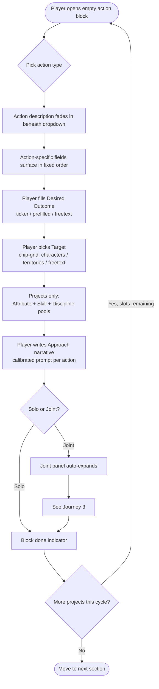
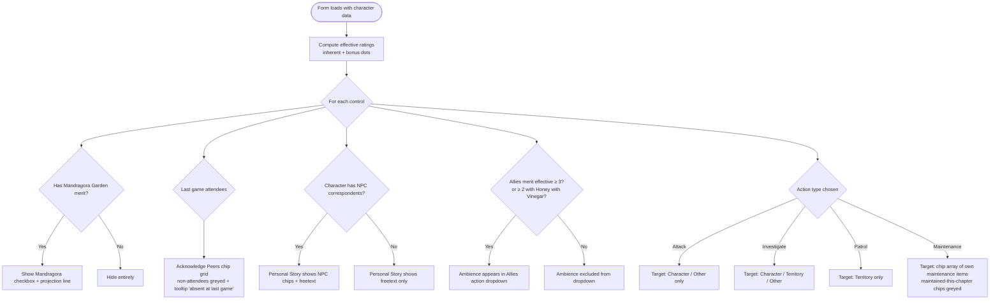
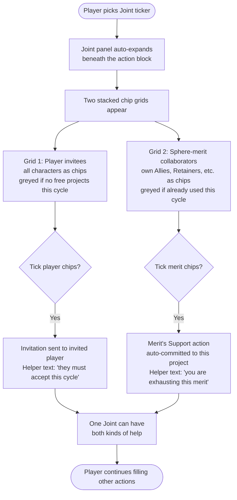

# UX Design Specification — Downtime Form Refactor

**Author:** Angelus
**Date:** 2026-04-29

---

<!-- UX design content will be appended sequentially through collaborative workflow steps -->

## Project Context

This is a focused UX redesign of the player-facing **Downtime Submission form** (`public/js/tabs/downtime-form.js`, ~5,300 lines). The form is the once-per-cycle interface where ~25 players file their character's off-screen actions for a Vampire: The Requiem 2nd Edition LARP.

The redesign is driven by a player-experience goal: **reduce mental load**. Remove freetext fields where the answer is determined; hide controls whose use is impossible in the current context; unify scattered UI patterns into a coherent grammar.

### Foundational Inputs

- **27 specific issues** captured from a walk-through of the form on 2026-04-29 (covering landing page, court, personal story, blood sorcery, feeding, projects, allies, joint action, targeting, descriptions)
- **Code review** of the current form structure, action-field matrix, and sphere-action variations
- **Player audience constraint:** desktop-first, no ST-fills-for-player path
- **Existing pattern:** the form already filters merit-based actions to "only show what the character has" — this redesign extends that grammar to cover everything (Mandragora visibility, peer acknowledgement, Ambience eligibility, etc.)

---

## Executive Summary

### Project Vision

Refactor the player-facing Downtime Submission form to reduce mental load. Extend the form's existing "show only what's relevant" grammar universally. Unify scattered UI patterns into a coherent ticker-based vocabulary. Establish a stable shell for project and merit-action blocks where only Target, Desired Outcome, and Approach morph per action type, so players learn the shape once and reuse it everywhere.

### Target Users

~25 LARP players in the Terra Mortis Vampire: The Requiem 2nd Edition chronicle. Desktop-first, mixed tech literacy. They fill the form once per cycle (~3 weeks), spending 30+ minutes of focused attention on a laptop or desktop, often a Tuesday evening after the game session. STs do not fill the form on a player's behalf — this is a single-audience tool.

### Key Design Challenges

1. **No progress orientation.** Twelve accordioned sections, all collapsed by default, no "X of Y done" signal.
2. **Scattered UI grammar.** Same gesture ("pick one of a few labelled options") rendered three different ways across the form — radios, dropdowns, checkboxes, pill-tickers. Players retrain muscle memory every section.
3. **Context-blind controls.** The form shows Mandragora checkboxes to non-Mandragora characters, lets players acknowledge peers who weren't at game, offers Ambience as an Allies action when the merit is below the eligibility threshold. Each is the form forgetting its own filter rule.
4. **Per-action UI fragmentation.** Project & merit-action blocks reshape around the chosen action with no consistent outer shell — Target sometimes appears, sometimes doesn't, in different positions, with different visual treatments.
5. **Joint-vs-collaboration mismatch.** "Joint" today only invites other players. There is no unified pattern for "I want help" that covers both human collaborators and the lead's own merits.
6. **Broken mobile fallback.** The current mobile redirect points to `/player`, which is defunct. Mobile users land on a dead page.

### Design Opportunities

1. **Universal filter rule.** Never show a control whose use is impossible in the current context. Already true for merit-based actions; extend to everywhere (Mandragora, peer acknowledgement, Ambience eligibility, NPC correspondents in Personal Story, etc.).
2. **Stable shell, smart contents.** Project and merit-action blocks share a fixed outer shape; only the Target selector, Desired Outcome treatment, and Approach prompt morph based on the chosen action.
3. **Ticker grammar.** Pill-style tickers replace radios and checkboxes everywhere a player picks from a small fixed set of options. One gesture, learned once.
4. **Joint as collaboration hub.** One mental model for "I want help." Inside the Joint panel: a chip grid of player invitees, and below it a chip grid of the lead's own sphere-merit collaborators (Allies, Retainers, etc.). Stacked, not side-by-side — each grid gets its own label and breathing room.
5. **Sticky progress rail.** A thin orientation aid showing section list with completion state, persistent as the player scrolls.
6. **Honest desktop-only stance.** Replace the broken mobile redirect with a clear "this works best on desktop" notice. The form is not optimised for mobile and will not be in this round.

---

## Core User Experience

### Defining Experience

The player files a downtime submission per cycle, configuring 4-12 distinct character actions across 12 sections (Court, Personal Story, Blood Sorcery, The City, Feeding, Projects, Allies, Status, Contacts, Retainers, Acquisitions, Equipment, Vamping, Admin — depending on character). Every UX decision serves the player working through that list without exhausting them.

### Platform Strategy

- **Web, desktop only.** Mouse and keyboard. Mobile rendering replaced by a clear "best on desktop" notice — no attempt to render the form responsively in this round.
- **Auto-save dual-tier.** localStorage at 800ms, server at 2000ms (already in place). The redesign should surface this trust signal more visibly.
- **Long session.** 30+ minutes of focused attention. The form must respect concentration and reward returning to a section after a break.
- **Single audience.** Players only. STs view but never fill on a player's behalf.

### Effortless Interactions

The seven moments that should feel like no thought at all:

1. **Picking an action type and watching the block configure itself.** The player picks "Attack" and the block shows them target chips, an outcome ticker, dice pool, approach. No thinking about which fields apply.
2. **Selecting a target.** One chip-grid pattern, used everywhere. Find the name, click. Done.
3. **Knowing the form saved.** A visible, trustworthy save signal that doesn't make them anxious.
4. **Seeing how much is left.** Glance at the progress rail, get oriented in two seconds.
5. **Not being shown what doesn't apply.** No Mandragora checkbox if you don't have the merit; no Acknowledge Peers options for absentees; no Ambience action on an Allies merit that can't qualify.
6. **Bringing in support.** Whether it's another player or your own Retainer, the gesture is the same: tick the chip in the Joint panel.
7. **Returning after a break.** Open the section, the work is there, exactly as you left it.

### Critical Success Moments

Five moments where the form makes or breaks itself:

1. **First open.** A new player encounters the form for the first time. If it feels overwhelming here, they bounce. The progress rail and clear section titles do the work.
2. **First action block.** They pick "Investigate" and need to know what to do. The block must guide them: action description appears, fields surface, prompts speak the language of the action.
3. **Save anxiety check.** They've typed 200 words of approach copy and click another section. Nothing visibly breaks. The save status reassures them.
4. **Submit.** They click Submit and see "Your downtime submission has been received." Closure.
5. **Outcome.** Days later, they open the Story tab and see the ST's published outcome of their work. The form was the bridge to that payoff.

### Experience Principles

Six concrete design rules. Each one earns its place by addressing a specific challenge from the discovery phase:

1. **Filter to context.** Never present a control whose use is impossible. Apply universally — merits, peers, eligibility, NPC selection, target options.
2. **One gesture per choice-shape.** Pill-tickers for "pick one of few"; chip grids for "pick from many"; same widget every time the same shape recurs.
3. **Stable shell, smart contents.** *(see Foundational Pattern below)*
4. **Prefill what's determined; freetext for narrative weight.** No field exists just to capture data the form already knows.
5. **Always-visible orientation.** A player can answer "where am I, how much left?" in two seconds without scrolling.
6. **Unified collaboration grammar.** "I want help" is the same gesture whether the helper is a player or a sphere-merit.

### Foundational Pattern

Of the six principles, one carries the weight of all the others: **Stable shell, smart contents.**

Every project block and merit-action block shares an identical outer shape — Action Type → Description → Desired Outcome → Target → (Dice Pool) → Approach → Solo/Joint. Within that shell, three zones morph based on the chosen action:

- **Target** — Character chips / Territory chips / Other freetext / Maintenance chip array, scoped per action
- **Desired Outcome** — Prefilled read-only / ticker / freetext / removed, per action
- **Approach prompt** — Calibrated copy per action

This is the load-bearing architectural decision. A 5-Whys traced the form's mental-load problem to a missing abstraction layer between heterogeneous data shapes (different actions need different inputs) and the homogeneous gesture players intuitively want ("configure an action"). The shell is that layer.

The other five principles serve or stand beside it. Without the shell, they are cosmetic.

---

## Desired Emotional Response

### Primary Emotional Goal

**Confident competence.** The player feels like a capable conspirator scheming on behalf of their character — focused and in-flow, not anxious, not lost, not bored. They are playing the game, even when the game is paperwork.

The phrase to hold against every UX decision: *"Does this make the player feel like a confident conspirator, or a confused form-filler?"*

### Emotional Journey

| Stage | What they feel | Why |
|---|---|---|
| First open of cycle | Curious, oriented | Progress rail + clear titles + auto-save reassurance |
| Court / Personal Story / Sorcery | Settling into character | Familiar opening rhythms — peer acknowledgement, callbacks |
| Territory + Feeding | Tactical | Mechanical engagement — picking territory, calculating ambience |
| Projects | Creative engagement | The schemes section. Plots, ambitions, vendettas |
| Merit-based actions | Detail-craft | Fiddling with the dials of their character |
| Vamping | Indulgent | Pure flavour — release valve from mechanical sections |
| Submit | Accomplishment + relief | Closure on a focused effort |
| Outcome (Story tab, days later) | Payoff + connection | The form was the bridge to a real ST narrative beat |

### Micro-emotions

| Aim for | Avoid |
|---|---|
| Confidence | Hesitancy ("can I select this?") |
| Trust | Anxiety ("did my work save?") |
| Engagement | Slog ("oh god, another section") |
| Accomplishment | Relief-from-pain (just glad it's over) |
| Belonging in the chronicle | Isolation from the broader story |

The key distinction is *accomplishment* vs *relief-from-pain*. Submission should feel like *"I crafted six good actions"*, not *"thank god that's over."* The difference is in mental load.

### Design Implications

| Emotion | UX Choice |
|---|---|
| Confident competence | **Filter to context.** Never surprise the player with a control they can't use. The form *understands* their character. |
| Creative engagement | **Calibrated Approach prompts.** The Attack Approach reads as a character-internal question, not a survey. The form speaks the language of the action. |
| Trust | **Visible save status + restore signal.** Auto-save isn't asked to be believed; it's *shown working.* |
| Closure | **Submit confirmation.** Post-submit state shows clear closure. |
| Anticipation + connection | **Form references the cycle.** Court pulls last game's attendees; post-submit state points to the Story tab. The form is plumbed into the chronicle. |

### Emotional Design Principles

Four principles that complement the experience principles from the previous section:

1. **The chore is roleplay.** Approach prompts read as character-internal questions. Action descriptions explain mechanics in narrative terms. Action type names (Hide/Protect, Patrol/Scout) are character-voice, not jargon.
2. **Never make the player doubt themselves.** Filter-to-context, prefilled outcomes, eligibility-aware lists — every presented choice should be a choice they can actually make.
3. **Trust is earned, not required.** Save status visible and trustworthy. Draft restore explicit. Players don't take auto-save on faith; they see it work.
4. **The form is a beat in the cycle, not a dead-end.** Backward references (last game's attendees, last game's events) and forward references (the Story tab) make the form feel like a connected scene, not isolated paperwork.

---

## UX Pattern Analysis & Inspiration

### Inspiring Products / Sources

**Internal precedent — patterns the suite already gets right:**

1. **The current Feeding section's pill-ticker** for feeding method (Kiss / Violent). The canonical "few-options" gesture, already established in the codebase.
2. **Character chip arrays** used in Joint invitees and elsewhere — coherent visual treatment of "pick from a roster."
3. **Territory pill selector** with state suffixes (Curated +3, Tended +2) — communicates rich state inside a small chip without clutter.
4. **DTU-2's draft restoration banner** — a one-shot, polite trust signal that appears exactly when needed and dismisses on its own.
5. **Section ticks** (`qf-section-tick ✔`) — quiet completion signal already living on every section heading.

**External precedent — patterns from products that handle long, high-trust, save-as-you-go workflows:**

6. **Notion's auto-save model** — silent "Saving…" → "Saved" transitions. Trust through visible state, not interruption.
7. **Linear's onboarding wizard** — compact progress rail, sections complete in order but revisitable. Numbered without being intimidating.
8. **GitHub issue forms / repo settings** — every field has a clear scope, prefilled defaults are obvious, submit confirmations are immediate and quiet.
9. **Typeform conditional questions** — "if you picked Attack, here are Attack's fields" rendered seamlessly, never feels like the form is showing its cogs.
10. **Stripe Atlas incorporation forms** — handles 30+ minutes of focused work with clear sectioning, persistent save status, prefilled determinable fields. Same emotional zone.

### Transferable UX Patterns

| Pattern | Source | Apply to |
|---|---|---|
| Pill-ticker for "pick one of few" | Suite's Feeding section | Solo/Joint, Method of Feeding, Attack outcome (Destroy/Degrade/Disrupt), Improve/Degrade for Ambience, Blood Type — replacing all radios and checkboxes |
| Chip grid for "pick one or many from roster" | Suite's Joint invitees | Targeting (character chips), Invitees, Sphere-merit collaborators, Maintenance items, NPC correspondents — single canonical widget |
| Silent auto-save state | Notion / Google Docs | Replace the buried `#dt-save-status` with a more visible-but-quiet save indicator anchored in sticky chrome |
| Sticky progress rail | Linear onboarding | Thin section list with completion ticks; click to jump. Answers "where am I, how much left" at a glance |
| Conditional fields seamlessly rendered | Typeform | When the player picks an action type, the block's fields appear in place without scroll jumps or layout shifts |
| Pre-filled defaults visible | GitHub forms | Prefilled Desired Outcome shown as filled-in read-only text, not as placeholder hint |
| One-shot status banners | Existing DTU-2 restore banner | Same pattern for "your work submitted successfully" — appearing once, dismissible |

### Anti-Patterns to Avoid

| Anti-pattern | Why we avoid it |
|---|---|
| Modal dialogs interrupting flow | The form is a long focused session. Modals break concentration. |
| Required-field validation as a wall at submit | Find errors as you go, not at the gate. |
| Hidden state ("did this save?") | Either show save state visibly, or never let the player wonder. |
| Mixed input vocabularies | Same gesture-shape must use the same widget. *(Load-bearing.)* |
| Default-collapsed sections re-collapsing on re-render | A section with dirty input must stay expanded across re-renders. |
| Aggressive clear/reset buttons | The form is precious work. No "clear all" near submit. |
| Truncating long select option lists | If we have 25 character chips, show all 25 in a grid. Truncation creates anxiety. |
| Inline "(?)" tooltip help | If a player needs help, the form failed to be self-explanatory. Use action descriptions and calibrated prompts instead. |

### Design Inspiration Strategy

**What to adopt directly:**
- Pill-ticker pattern from Feeding becomes the canonical "pick one of few" widget across the form
- Chip-grid pattern from Joint invitees becomes the canonical "pick from roster" widget
- DTU-2's quiet one-shot banner pattern extends to submit confirmation and other transient states

**What to adapt:**
- Linear-style progress rail, in our gold-on-dark visual language
- Notion-style silent save state, anchored more visibly than the current buried line — players have explicitly asked for trust here
- Typeform-style conditional fields, rendered inside our existing accordion sections (no need to swap to wizard format)

**What to avoid:**
- No new modal patterns — the rote-cast modal is enough debt; we want fewer modals, not more
- No inline-(?) help tooltips — action descriptions and Approach prompts replace that need
- No validation walls — keep the form forgiving while making correct paths obvious

### Key Reflection

Most of the patterns we want already exist somewhere in the suite or the form — they just aren't applied consistently. The redesign is more about **harmonising existing patterns** than inventing new ones. Good news for implementation cost and risk.

---

## Design System Foundation

### Design System Choice

**Custom design system (existing TM Suite) — extended in place.** Not a new system, not a third-party library. The downtime form lives inside the established TM Suite visual language; the redesign harmonises and extends.

### Rationale for Selection

- A mature design system already exists with documented tokens, typography, dot semantics, and component conventions
- The form's mental-load problem is consistency, not visual identity — swapping foundations would not solve it and would introduce risk
- Reference docs already exist (CSS tokens, parchment theme, typography, dot display) for the dev agent to follow

### Existing Foundation

**Tokens (CSS custom properties on `:root`):**
- Background: `--bg: #0D0B09`
- Gold accents: `--gold1`, `--gold2: #E0C47A`, `--gold3` tiers
- Surface tiers: `--surf1`, `--surf2`, `--surf3`
- Crimson for damage/danger states: `--crim: #8B0000`
- Documented at `reference_css_token_system.md` — all colour through tokens, zero bare hex in rule bodies

**Typography:**
- Cinzel / Cinzel Decorative for headings (Google Fonts CDN)
- Lora for body
- Documented at `reference_typography_system.md`

**Visual motifs:**
- Filled circle (●, U+25CF) for inherent dots; hollow circle (○) for derived (`reference_dot_display_system.md`)
- Parchment-surface override applied to DT form (`reference_parchment_theme_overrides.md`)
- British English throughout, no em-dashes

**Established components in the form:**
- `.qf-section` accordion family (`.qf-section-title`, `.qf-section-tick`, `.qf-section-body`)
- `.dt-status-badges`, `.dt-badge`
- `.qf-textarea`, `.qf-btn`
- Character chips (in joint invitees)
- Territory pills (in feeding territory selector)
- Feeding-method tickers (Kiss / Violent)
- DTU-2 one-shot banner pattern

### Implementation Approach — what we add

| New component | Built from | Replaces |
|---|---|---|
| **`.dt-ticker`** — pill-ticker for "pick one of few" | Existing feeding-method ticker styling, promoted to a reusable class | Solo/Joint radios, Blood Type checkboxes, all "pick one of few" controls |
| **`.dt-chip-grid`** — chip grid for "pick from roster" | Existing joint-invitees chip styling, promoted to a reusable grid container | All target pickers (character/territory), Invitees, sphere-merit collaborators, NPC selectors, maintenance chips |
| **`.dt-progress-rail`** — sticky progress sidebar | New component in TM Suite vocabulary | Fills a gap — currently nothing |
| **Filter-to-context protocol** | Pure logic — extends existing merit-filter pattern | Ad-hoc visibility logic across sections |

### Customisation Strategy

**Component rules:**
1. **Use existing tokens only.** No new colour values. The pill-ticker's active state uses `--gold2`; inactive uses `--surf2` or equivalent. If a new visual need can't be expressed in existing tokens, revisit the token system rather than bypass it.
2. **Inherit existing typography.** Cinzel for component labels where appropriate, Lora for body. No new font weights.
3. **Match existing dot-display semantics.** Inherent vs derived dots already established.
4. **British English, no em-dashes** in any new copy.
5. **Touch targets ≥ 32px** for tickers and chips.

**Placement rules:**
1. Form-specific styling lives in the existing DT form CSS file
2. Suite-wide patterns elevated to `components.css` only if reused outside DT form
3. No new CSS files unless genuinely warranted by scope

---

## Defining Experience

### The Atom of the Form

**Configuring an action block.** The player picks an action type, and the form responds by reshaping the block around that action — showing the right target selector, surfacing the right outcome treatment, asking the right calibrated approach question, offering Solo or Joint at the bottom.

This single interaction repeats 4-6 times per cycle (across projects and merit-based actions). It *is* the form. Get it right, the rest follows.

The phrase to hold against every implementation decision: *"Does picking an action and watching the block configure itself feel like one fluid gesture, or like reshuffling six independent fields?"*

### User Mental Model

The player is **commissioning an action**. They arrive at an empty action block with a goal in mind:

> *"I want to plant rumours about Cyrus's territory dealings."*

The form's job is to translate that intention into a structured submission, asking only the questions the action genuinely needs, in the order the player thinks them:

- *What kind of action is this?* → Attack
- *Against whom?* → Cyrus
- *To what outcome?* → Degrade his Status
- *Using what dice?* → Manipulation + Subterfuge + Auspex
- *In what narrative way?* → "I plant rumours through my Contacts about a fabricated indiscretion..."
- *Alone or with help?* → Joint (with my Allies as Support)

**Where players currently get confused:**
- "Do I fill out the merits-committed picker, or is that for a different kind of action?"
- "Where do I select the territory I'm targeting?"
- "Why is the Joint target a separate set of fields from the project target?"
- "Wait, this Allies action is offering me Ambience but my merit doesn't qualify — did I do something wrong?"

Each is a moment where the form's grammar disagrees with the player's intent.

### Success Criteria

The action-block interaction succeeds when:

1. **Picking an action reshapes the block immediately and legibly.** Action description appears, fields surface, prompts speak the action's language. No scroll jumps. No mystery fields.
2. **Every visible field is one the player needs.** No "is this for me?" questions about field relevance.
3. **Target selection feels identical regardless of action type.** Same chip-grid pattern, same gesture, every time.
4. **The Approach prompt feels like a character-internal question.** Not "describe what you do" but "How do you attempt to destroy or undermine this target?"
5. **Solo/Joint is the last decision, not the first.** Player has fully designed the action before deciding whether to bring help.
6. **Joint extends, never restarts.** Switching to Joint surfaces the invitee panel beneath the existing fields; nothing already filled gets re-asked.
7. **Adding a second action feels like the same gesture.** No retraining. The second block reuses every motor pattern from the first.

### Novel vs. Established Patterns

Mostly established patterns combined with new consistency-of-application discipline.

**The components are all proven:**
- Pill-tickers (established in feeding section)
- Chip grids (established in joint invitees)
- Conditional fields based on dropdown selection (Typeform, GitHub forms)
- Action-specific prompts (any well-designed survey)

**The novelty is in *consistency of application*** — using the same widgets and field grammar across all action types and contexts. Discipline, not invention.

**The one near-novel pattern:** Joint as collaboration hub (humans + own merits in stacked chip grids). Composes from familiar parts — chip grids, opt-in expansion, role assignment. Players will grok it without onboarding.

**No user education required.** Pattern continuity does the teaching.

### Experience Mechanics

The action-block lifecycle, step by step:

| Step | Player action | Form response |
|---|---|---|
| 1. Initiation | Scrolls to an empty project slot, or clicks "Add project" | Empty block visible; action-type dropdown is the first choice |
| 2. Action type pick | Selects e.g. "Attack" | Action description fades in below dropdown; relevant fields surface — Outcome ticker, Target chips, Dice pool, Approach prompt |
| 3. Outcome | Picks Destroy / Degrade / Disrupt ticker | Selected pill highlights gold; outcome locked in |
| 4. Target | Clicks Cyrus's chip in the character grid | Chip highlights gold; other chips remain selectable |
| 5. Dice pool | Picks Attribute + Skill + Discipline (project only) | Pool total updates as selections combine |
| 6. Approach | Types narrative description | Auto-save indicator quietly updates ("Saving…" → "Saved") |
| 7. Solo/Joint | Defaults Solo. Toggling Joint expands invitee panel below | Invitee chip grid appears (player chips greyed if no free projects); sphere-merit chip grid below it |
| 8. Joint specifics | Ticks invitees and/or merits | Each tick lights gold; helper text explains exhaustion implications |
| 9. Block complete | Scrolls past, or collapses section | Subtle done-state indicator signals "this slot is configured" |

**Mistake recovery:**
- Change action type mid-flow → block reshapes; matching field values preserved (Dice pool, Approach text); incompatible fields cleared with quiet notice
- Change target → previous chip un-lights, new chip lights; no confirmation needed
- Backspace freely; no validation walls during input
- Submit-time validation finds errors *as you go* via section ticks, not as a wall at submit

---

## Visual Design Foundation

### Brand Guidelines Status

The TM Suite design system is established and documented. The visual foundation for new components inherits from existing reference docs:
- `reference_css_token_system.md` — colour token vocabulary
- `reference_typography_system.md` — Cinzel/Lora type system
- `reference_dot_display_system.md` — inherent vs derived dot semantics
- `reference_parchment_theme_overrides.md` — DT form parchment surface

### Color System — new component states

#### `.dt-ticker` (pill-ticker)

| State | Background | Text / Border |
|---|---|---|
| Default | `--surf2` | `--gold3` text, subtle `--surf3` border |
| Hover | `--surf3` | `--gold2` text |
| Active (selected) | `--gold2` | Dark text (`--bg`) for contrast |
| Disabled (greyed) | `--surf2` faded (50% opacity) | `--surf-fg-muted` text, cursor: not-allowed |

#### `.dt-chip-grid` chips

| State | Background | Border |
|---|---|---|
| Default | parchment surface (existing chip class) | subtle `--surf3` |
| Hover | unchanged | `--gold3` border |
| Selected | unchanged | `--gold2` border, gold fill or accent dot |
| Disabled (no free projects / already maintained) | faded (50-60% opacity) | desaturated; `cursor: not-allowed`; tooltip explains why |

#### `.dt-progress-rail`

| State | Treatment |
|---|---|
| Section item — incomplete | Lora regular, `--surf-fg-muted` |
| Section item — in progress (dirty) | Lora regular, `--gold3`, subtle underline |
| Section item — complete | Lora regular, `--gold2`, ✔ tick prefix |
| Section item — current (player is in it) | Lora bold, `--gold1` |
| Container | thin sticky sidebar, `--bg` or `--surf1`, no border |

### Typography System — new component application

| Component | Typeface | Weight / Size | Notes |
|---|---|---|---|
| Ticker labels | Cinzel | Regular, small (~13-14px) | Matches existing feeding-method ticker |
| Chip labels (character/territory names) | Lora | Regular, body (~14px) | Standard readable body |
| Action type description copy | Lora | Italic, body (~14px) | Italic signals "context, not instruction" |
| Approach prompt | Lora | Italic, body (~14px) | Matches existing `qf-desc` styling |
| Progress rail section labels | Lora | Regular, small (~13px) | Compact for sidebar |
| Helper text (e.g. exhaustion notices) | Lora | Italic small (~12-13px) | Existing `qf-desc` pattern |
| Action type dropdown | Lora | Regular, body | No change from existing select styling |

### Spacing & Layout Foundation

**Base spacing unit:** 8px (existing suite convention).

| Element | Spacing |
|---|---|
| Action block internal padding | 24px (3 × base) |
| Action block separation | 16px (2 × base) |
| Chip-grid gap | 8-12px (1-1.5 × base) |
| Ticker gap | 4-8px (0.5-1 × base) |
| Section accordion padding | inherits from `.qf-section` (no change) |
| Progress rail width | 180-220px right-anchored |
| Progress rail item height | 32-36px (comfortable click target) |

**Layout principles:**

1. **Single column form body, sidebar progress rail.** The form's main scroll is unchanged; the progress rail is new chrome beside it.
2. **Action blocks expand to full content width within their section.** No horizontal split-panes in action blocks.
3. **Chip grids wrap responsively** within their container (no horizontal scroll). At ~1280px viewport, character chips wrap to 4 columns; territory chips wrap to 6.
4. **Stacked grids in Joint panel:** invitee chip grid → label gap (16px) → sphere-merit chip grid. Each grid headed by its own label.

### Token Discipline

The single rule that makes visual consistency self-enforcing: **every colour reference goes through a CSS custom property; if a needed role doesn't have a token, create one — never fall back to a bare value.**

**Tokenised dimensions (binding contract):**

| Dimension | Status | Rule |
|---|---|---|
| Colour | Fully tokenised | Zero bare hex in rule bodies. New colour roles get new `:root` tokens following existing naming families (`--gold*`, `--surf*`, `--crim`, etc.) or a new family if the role is genuinely new (e.g. `--state-disabled-bg`). |
| Typography font family | Tokenised by stack reference | Use the established `font-family` declarations (Cinzel for headings, Lora for body). No new font stacks. |

**Match-existing-convention dimensions (for this round):**

| Dimension | Status | Rule |
|---|---|---|
| Type scale (font sizes) | Raw px values | Match existing convention. Future refactor opportunity to introduce `--text-*` scale tokens. Flag but don't address in this round. |
| Spacing | Raw px values, 8px base convention | Match existing convention. Future refactor opportunity to introduce `--space-*` tokens. Flag but don't address in this round. |

**When to add a new token:**

If a new component genuinely needs a colour, opacity, or accent that no existing token expresses, add a new token on `:root` rather than inline the value. The token should:
- Follow existing naming families where possible (`--gold4` for a new gold tier, not `--accent`)
- Document its semantic role in a brief comment in the `:root` block
- Replace any prior inline use of that value across the codebase

**The audit rule:** A grep for bare hex codes in CSS rule bodies (outside `:root` and `:root`-scoped blocks) should return zero hits at any commit.

**Why this matters:**
- Single-line change on `:root` propagates everywhere — never a hunt
- Future theme variations (high-contrast, light mode if ever introduced) become possible by swapping one block
- New components automatically inherit any palette refinement
- Onboarding a new dev means learning the token vocabulary, not memorising hex codes

### Accessibility Considerations

- **Focus states visible.** Gold outline (`--gold2`) on keyboard focus for all tickers, chips, and form controls. Never `outline: none` without alternative.
- **Touch targets ≥ 32px** for tickers and chips, even on desktop.
- **Contrast.** Gold (`--gold2 #E0C47A`) on dark (`--bg #0D0B09`) gives ratio ~10.5:1 — comfortably exceeds WCAG AA. Verify any new combinations stay above 4.5:1 for text.
- **Disabled state non-colour cues.** Greyed chips/tickers must reduce opacity AND use `cursor: not-allowed` AND show a hover tooltip explaining why — never colour-only signal.
- **Keyboard navigation.** Tab through tickers (single tab stop per group, arrow keys to navigate within), chips (each chip a tab stop), progress rail items.
- **Reduced motion.** If `prefers-reduced-motion: reduce`, fade-in for action description copy uses no transition; section accordion is static.
- **Screen reader labels.** Each ticker group needs an `aria-label` or fieldset legend; each chip grid needs an `aria-labelledby`; chips with disabled state need descriptive `aria-disabled` and tooltip text.

---

## Design Direction

### Direction Name

**Stable Shell / Filtered Grammar / Sticky Orientation**

### Direction Summary

Every project and merit-action shares an identical outer block shape, with three internal zones (Target, Outcome, Approach) that morph based on the chosen action. UI patterns — pill-tickers for "pick one of few", chip-grids for "pick from roster" — are unified across the entire form, replacing scattered radios and checkboxes. A sticky right-edge progress rail gives players orientation across the long form, and section/control visibility is filtered to context so impossible choices never appear.

This direction is the synthesis of every decision in steps 3-8. No separate alternative direction was explored — the disagreements would be cosmetic, not substantive.

### Visual Treatment Summary

- **Theme:** Existing TM Suite parchment-and-gold dark theme, no change
- **Typography:** Cinzel headings, Lora body, no change
- **Layout:** Single-column form body, sticky progress rail at right, 1280px+ desktop only
- **Density:** Comfortable — 24px action block padding, 8-12px chip gaps. Not dense like a spreadsheet, not airy like a marketing page. Forms the player can work in for 30 minutes without eye fatigue.
- **Visual weight:** Approach prompt and Action description copy are visually quieter than headings (italic Lora). Interactive controls (tickers, chips, dropdowns) carry visual weight where the player is making decisions.

### Layout Decisions

1. **Add-project button — below the last block.** Closest to where the player just finished filling in. Must show remaining slot count clearly so player knows when they've hit their limit.
2. **Joint panel — auto-expands on Joint selection.** Player just said "yes, I want help" — show them the help options immediately. No extra click.
3. **Section accordion — explicit expand, dirty sections stay open across re-renders.** Preserves player control; the dirty-stays-open rule fixes the only legitimate complaint about explicit-expand behaviour.
4. **Submit button — bottom of form, not sticky.** Submission requires deliberate effort. Sticky-always submit invites accidental clicks during scrolling. The player journeys to submit, not stumbles into it.

### Why no mockup variations

The workflow's typical 6-8 design directions aren't applicable here. Visual identity is locked (existing system); structural decisions are opinionated and committed (Steps 3-8). A separate static HTML reference page rendering components in their states is recommended after the spec is locked, as a deliverable for the dev agent.

---

## User Journey Flows

### Critical Journey 1 — Configuring an Action Block

This is the journey the player walks 4-6 times per cycle. If this is good, the form is good.



**Mistake recovery within the flow:**
- Mid-flow action change → block reshapes; matching field values preserved (e.g. Dice pool, Approach text); incompatible fields cleared with quiet inline notice
- Backspace freely; no validation walls during input
- Auto-save runs throughout (localStorage 800ms, server 2000ms)

### Critical Journey 2 — Filter-to-Context (rendering protocol)

Not a single user-initiated journey — a *rendering protocol* the form runs continuously, but it shapes the player's perception of every section.



**The protocol's invariant:** A player should never be presented with a control whose use is impossible in the current context. Every rendering decision flows through this rule.

### Critical Journey 3 — Joint Collaboration with Player + Merit

The novel pattern. Where the redesign's most meaningful innovation lives.



**The unlock:** the player learns one mental model — *"I want help, I tick chips in the Joint panel"* — and it covers both human collaborators and merit collaborators with no separate flow.

### Journey Patterns

Cross-cutting patterns applied across every section:

| Pattern | Applied where | Implementation rule |
|---|---|---|
| Filter-then-render | Every section render | A context-check (effective rating, inventory, attendance, prior selections) precedes any control output. Impossible options never reach the DOM. |
| Pick-then-reveal | Action type pick, Solo→Joint toggle, target type radio | Selecting an option triggers immediate inline UI surface (no scroll jumps, no modals). |
| Auto-commit | Joint sphere-merit ticks | Selecting a merit in the Joint panel auto-creates that merit's Support entry — player doesn't separately fill the merit's action form. |
| Effective-rating-aware | All eligibility, calculation, and prereq checks | Always read effective rating (inherent + bonus dots), never inherent only. Documented in `feedback_effective_rating_discipline.md`. |
| Greyed-with-reason | Any disabled chip or ticker | Disabled controls show tooltip explaining the disablement reason. Colour-fade is never the only signal. |
| Quiet save | Throughout the form | Auto-save runs at 800ms (local) and 2000ms (server). Save state visible but not interrupting; restore-from-local banner appears once on draft restoration. |

### Flow Optimization Principles

1. **Compatible state survives action changes.** When a player switches action type mid-flow, fields that share a meaning (Approach text, Dice pool) are preserved. Fields that don't apply are cleared with a quiet inline notice rather than silently dropped.
2. **Validation finds errors as they happen, never as a wall.** Section-level ticks update live. No "submit-button reveals 12 errors" anti-pattern.
3. **The player journeys to submit, never stumbles into it.** Submit is bottom-of-form, scroll-to-reach. No sticky always-available submit. Submission is a deliberate gesture.

---

## Component Strategy

### Foundation Components (existing — no change)

Inherited from the TM Suite design system, used as-is:

| Component | Purpose | Source |
|---|---|---|
| `.qf-section` family (`.qf-section-title`, `.qf-section-tick`, `.qf-section-body`) | Accordion section shell | Existing |
| `.qf-textarea` | Text input area | Existing |
| `.qf-btn` (primary, save, submit variants) | Form buttons | Existing |
| `.qf-field` and `.qf-label` | Field wrappers | Existing |
| Select/dropdown styling | Action type pickers, dice pool selectors | Existing |
| `.dt-status-badges` and `.dt-badge` | Header status indicators | Existing |
| Dot display (●/○) | Inherent vs derived rating display | Existing (`reference_dot_display_system.md`) |
| `.qf-results-banner` family | Restore-from-localStorage notice; submit confirmation | Existing (DTU-2 pattern) |

### New Components

Eight components introduced or enhanced for this redesign.

#### Atomic 1: `.dt-ticker`

**Purpose:** Pill-style "pick one of few" selector. Replaces radios and small checkbox groups.

**Usage:** Solo/Joint, Method of Feeding (Kiss/Assault), Attack outcome (Destroy/Degrade/Disrupt), Improve/Degrade for Ambience, Blood Type (Animal/Human/Kindred).

**Anatomy:** Row of pill-shaped buttons with rounded corners; label text only; visual unification across pills.

**States:**

| State | Visual |
|---|---|
| Default | `--surf2` background, `--gold3` text, subtle `--surf3` border |
| Hover | `--surf3` background, `--gold2` text |
| Active (selected) | `--gold2` background, dark text (`--bg`) |
| Disabled | `--surf2` faded 50% opacity, `--surf-fg-muted` text, `cursor: not-allowed`, tooltip explains why |
| Focus (keyboard) | Gold outline (`--gold2`) ring at 2px |

**Accessibility:** Implement as a `<fieldset>` with `role="radiogroup"`. `aria-label` or legend names the group. Arrow keys navigate between pills. Disabled pills get `aria-disabled="true"` and tooltip text.

**Content guidelines:** Labels short (1-3 words), sentence-case or character-voice.

#### Atomic 2: `.dt-chip`

**Purpose:** Single selectable chip representing an entity (character, territory, NPC, merit, maintenance item).

**Usage:** Always inside a `.dt-chip-grid` container.

**Anatomy:** Rounded rectangular pill (fully pill-shaped); label text plus optional small suffix (e.g. territory state "Curated +3"); 32-44px height.

**States:**

| State | Visual |
|---|---|
| Default | parchment surface, subtle `--surf3` border |
| Hover | `--gold3` border |
| Selected | `--gold2` border + small gold accent dot |
| Disabled | 50-60% opacity, desaturated, `cursor: not-allowed`, tooltip explains disablement |
| Focus | Gold (`--gold2`) outline ring at 2px |

**Variants:** Standard / Stateful (with suffix) / Multi-select / Single-select.

**Accessibility:** Role depends on grid context (button, checkbox, or radio). Disabled state: `aria-disabled="true"` + tooltip.

**Content guidelines:** Display name preferred; British English.

#### Atomic 3: `.dt-chip-grid`

**Purpose:** Layout container for a roster of `.dt-chip` components, with selection semantics.

**Usage:** Targeting (Character / Territory), Joint invitees, sphere-merit collaborators, maintenance items, NPC correspondents, Acknowledge Peers.

**Anatomy:** Responsive grid wrapping at container width; optional grid label/heading and helper text.

**Variants:**

| Variant | Behaviour |
|---|---|
| `single-select` | Exactly one chip selected; clicking another deselects the first |
| `multi-select` | Any number selected; clicking toggles |
| `single-select-required` | Single-select with enforced selection (cannot deselect to zero) |

**Layout:** Grid columns adapt to container — at ≥1280px: 4 columns characters / 6 territories. Below 1024px: not supported (form is desktop-only).

**Accessibility:** `<div role="group" aria-labelledby="...">` with visible label. Each chip keyboard-navigable. Disabled chips get descriptive tooltips.

**Content guidelines:** Sort alphabetically by display name. Never paginate or "show more" — show all chips at once.

#### Atomic 4: `.dt-action-desc`

**Purpose:** Italic descriptive copy block beneath an action-type dropdown to explain the chosen action.

**Usage:** Once below the action-type dropdown after the player picks an action. Read-only.

**Anatomy:** Single paragraph of italic Lora body text (~14px); muted text colour; 8px top margin / 16px bottom; fade-in 200ms on action change.

**Accessibility:** `<p>` with `aria-live="polite"` so screen readers announce the description on action change. Reduced motion: skip the fade.

**Content guidelines:** Per-action calibrated copy from the spec — player-voice.

#### Compound 1: `.dt-action-block`

**Purpose:** The stable shell housing a single project or merit-based action. The atom of the form.

**Usage:** One per project slot; one per merit-based action.

**Anatomy:**

```
┌─ .dt-action-block ──────────────────────────────────────┐
│  [action-type dropdown]                                 │
│  .dt-action-desc (italic copy)                          │
│  [Desired Outcome zone — varies per action]             │
│  [Target zone — varies per action: chip-grid/freetext]  │
│  [Dice pool — projects only]                            │
│  [Approach textarea with calibrated prompt]             │
│  .dt-ticker (Solo / Joint)                              │
│  .dt-joint-panel (collapsed by default; expands on Joint) │
└─────────────────────────────────────────────────────────┘
```

**States:** Empty (only dropdown visible) / Active (zones surfaced) / Configured (subtle gold accent border).

**Variants:** Project block (full, with Dice pool) / Merit-action block (no Dice pool, no Approach for Allies).

**Accessibility:** `<fieldset>` with legend showing block index. Tab order respects visual flow. ARIA-live regions for surfacing fields.

#### Compound 2: `.dt-joint-panel`

**Purpose:** Collaboration hub. Auto-expands when player picks Joint. Houses two stacked chip grids.

**Anatomy:**

```
┌─ .dt-joint-panel ────────────────────────────────────────┐
│  [Joint description / context copy]                      │
│  ── Players ──                                           │
│    .dt-chip-grid (multi-select, character roster)        │
│  ── Your Allies and Retainers ──                         │
│    .dt-chip-grid (multi-select, own sphere merits)       │
│  Helper text: 'Selected merits commit their support      │
│  action automatically.'                                   │
└──────────────────────────────────────────────────────────┘
```

**States:** Collapsed (Solo) / Expanded (Joint) / Empty Joint (Joint selected, no chips ticked — valid state).

**Accessibility:** `<section>` with heading. Each chip-grid retains its own labelledby. `aria-expanded` on parent block. Reduced motion: skip auto-expand animation.

#### Compound 3: `.dt-progress-rail`

**Purpose:** Sticky sidebar showing form section list with completion state.

**Anatomy:**

```
┌─ .dt-progress-rail ──┐
│  Court            ✔  │
│  Personal Story   ✔  │
│  Blood Sorcery    ✔  │
│  The City         ●  │ ← current
│  Feeding             │
│  Projects (1/3)      │
│  Allies              │
│  Acquisitions        │
│  Equipment           │
│  Vamping             │
│  Admin               │
└──────────────────────┘
```

**States:**

| Item state | Visual |
|---|---|
| Incomplete | Lora regular, `--surf-fg-muted` |
| In progress (dirty) | Lora regular, `--gold3`, subtle underline |
| Complete | Lora regular, `--gold2`, ✔ tick prefix |
| Current | Lora bold, `--gold1`, ● dot prefix |
| Disabled (gated section, not applicable) | hidden entirely |

**Behaviour:** Each item clickable → scrolls to and expands the section. Slot count surfaced where relevant ("Projects (1/3)"). Gated sections that don't apply to this character are excluded entirely.

**Accessibility:** `<nav aria-label="Form progress">`. Items as `<a>` or `<button>`. Current section: `aria-current="step"`. Reduced motion: instant scroll.

#### Atomic 5 (enhanced): `.dt-save-status`

**Purpose:** Visible auto-save indicator. Replaces the buried `#dt-save-status` line.

**Usage:** Anchored in form chrome — near header or in progress rail.

**States:**

| State | Text |
|---|---|
| Idle | Empty / "Saved" with timestamp |
| Saving | "Saving…" with subtle pulse |
| Saved | "Saved" (fades cleanly from Saving) |
| Save failed | "Save failed — retrying" with `--crim` accent |
| Restored from local | One-shot banner above form (existing DTU-2 pattern) |

**Accessibility:** `aria-live="polite"`. Reduced motion: no pulse.

**Content guidelines:** Short, direct. No exuberance.

#### Cross-cutting: Filter-to-Context Protocol

**Purpose:** A rendering protocol — not a visual component. Ensures every section's render starts with a context check.

**Specification:**

```
For every section render:
  1. Compute character context:
     - Effective ratings (inherent + bonus dots) for all merits
     - Last game attendance state
     - Cycle state (game session, free project counts)
     - Existing merit/maintenance state
  2. For each control in the section, evaluate whether
     its use is possible given the context
  3. If impossible:
     - Default: hide entirely
     - Greyed-with-reason: render disabled with tooltip
       (use when the player should know the option exists
       but isn't currently available — e.g. peers absent at last game)
  4. Effective rating is always used — never inherent only
  5. Re-evaluate on relevant state changes (action type pick,
     toggle, prior selection)
```

**Implementation note:** Logic-only. No CSS class. Documented as a coding rule for the dev agent.

### Implementation Roadmap

**Phase 1 — Foundation atomics:**
1. `.dt-ticker` — most-reused; unblocks Solo/Joint, feeding method, Improve/Degrade, Attack outcome, Blood Type
2. `.dt-chip` and `.dt-chip-grid` — unblocks targeting, invitees, sphere merits, NPC selection, Acknowledge Peers, maintenance
3. `.dt-action-desc` — straightforward; unblocks every action-block redesign

**Phase 2 — Compounds:**
4. `.dt-action-block` — depends on phase 1; the heart of the redesign
5. `.dt-joint-panel` — depends on action-block; contains the new collaboration pattern

**Phase 3 — Orientation chrome:**
6. `.dt-progress-rail` — independent of phases 1-2; can be developed in parallel
7. `.dt-save-status` enhancement — independent; small change

**Phase 4 — Cross-cutting protocol:**
8. Filter-to-context — applied progressively as each section is touched. Sections can adopt the protocol incrementally; no big-bang refactor needed.

**Sequencing rationale:** Atomics first (every compound depends on them). Action-block before progress-rail (more downstream impact). Filter-to-context as a continuous protocol, not a single feature.

---

## UX Consistency Patterns

### Pattern 1 — Button Hierarchy

| Tier | Visual | Use |
|---|---|---|
| Primary | `--gold2` filled background, dark text | Submit (one per form), terminal commit actions |
| Secondary | `--surf2` background, `--gold2` text or border | Save Draft, Add Project, primary in-section actions |
| Tertiary | Text-only, `--gold3` colour, no background | Cancel, Decouple, "remove this slot", quiet utility |

**Rules:**
- One primary button per form. Submit is *the* primary action.
- Destructive actions (cancel a Joint, retract an invitation) are tertiary by default — quiet treatment, not a red shout. Confirmation flows guard the dangerous ones.
- Buttons live in form chrome (header / `.qf-actions` block at bottom) — not floating, not sticky.

### Pattern 2 — Feedback Patterns

| Channel | Mechanism | When |
|---|---|---|
| Auto-save state | `.dt-save-status` inline, `aria-live="polite"` | Continuous, throughout form |
| Restore from localStorage | One-shot `.qf-results-banner` (DTU-2 pattern), dismissible | Once on form load if local snapshot is fresher than server |
| Submit confirmation | One-shot banner: "Your downtime submission has been received" | Once after successful submit |
| Submit error | Inline error banner with retry affordance | When server rejects submission |
| Per-field validation | Inline beneath field; section tick withholds when section has errors | Live as the player edits |

**Rules:**
- No toast notifications. Banners (one-shot) and inline state (continuous) instead.
- No interrupting modals for feedback. Even errors are inline.
- Validation finds errors *as you go*, never as a wall at submit. Section ticks update live.
- All `aria-live` regions use `polite` — never `assertive`.

### Pattern 3 — Form Input Patterns

The grammar for any field:

```
┌─ .qf-field ─────────────────────────────────────────────┐
│  [.qf-label — bold, character-voice question]           │
│  [.qf-desc — italic helper text, optional]              │
│  [the actual input: textarea, dropdown, ticker, chips]  │
│  [validation message — inline, only if error]           │
└─────────────────────────────────────────────────────────┘
```

**Label rules:**
- Labels are character-voice questions where possible: *"How does your character hunt?"* not *"Hunt description"*
- Required fields are not visually marked at the label; the section tick acknowledges completion. (No red asterisks.)

**Prompt/helper text rules:**
- Italic Lora, muted colour
- Sits between label and input
- Used when the field needs framing beyond the label
- Never used for instructions like "fill this in" — the field's existence is the instruction

**Input rules:**
- Tickers for "pick one of few"
- Chip-grids for "pick from roster"
- Dropdowns for action types (large fixed list)
- Textareas for narrative input
- Never a mix of these for the same gesture-shape

**Conditional field appearance:**
- New fields fade in (200ms) when their condition becomes true
- Fields removed by condition change fade out (200ms); their values clear if incompatible
- No layout jumps; reserve vertical space gracefully or animate the height transition

### Pattern 4 — Navigation Patterns

| Surface | Behaviour |
|---|---|
| Section accordion | Click section title to expand/collapse. Default collapsed. Dirty sections stay open across re-renders. Multiple may be open simultaneously. |
| `.dt-progress-rail` | Sticky right sidebar. Click section name to scroll-to and expand. Shows completion state per section. |
| Scroll | Vertical scroll for full form length. Browser back button doesn't apply (single-page form). |

**Rules:**
- No page-level routing. The form is one URL, one continuous DOM.
- No "back" / "next" buttons between sections. Sections aren't sequential.
- Anchor scrolling uses smooth scroll behaviour, except under `prefers-reduced-motion`.

### Pattern 5 — Modal / Overlay Patterns

**Strong default: no new modals.** Modals break concentration in a long focused session. The redesign explicitly avoids introducing them.

**Existing exception:** The rote-cast modal (line ~2447 of `downtime-form.js`). Acceptable in the short term as legacy debt. Long term, fold its functionality into the action-block flow inline. Flagged for future refactor; not in this round's scope.

**If a modal is genuinely needed in future:**
- Centred overlay with darkened backdrop (`--bg` at ~80% opacity)
- Title + body + action buttons (cancel left, confirm right)
- ESC closes; click backdrop closes; tab trapped within
- `role="dialog"` with `aria-labelledby` and `aria-describedby`

### Pattern 6 — Empty / Loading / Error States

| State | Treatment |
|---|---|
| Form loading | Existing `<p class="placeholder-msg">Loading…</p>`; brief text, no spinner |
| Form failed to load | Existing pattern: `<p class="placeholder-msg">Failed to load: ...</p>` |
| Empty action block (no action picked) | Dropdown visible, all other zones hidden; no placeholder copy |
| No projects yet | Section visible with one empty action block; "Add another project" button beneath |
| No qualifying merits for an action | Action excluded from dropdown (filter-to-context); no error, no notice |
| Server save failed | `.dt-save-status` shows "Save failed — retrying" with `--crim` accent; retry happens automatically; persistent failure surfaces banner with manual retry |
| Stale data (cycle changed mid-form) | Banner: "This cycle has closed. Your draft is preserved." Section tickers and submit disabled. |

### Pattern 7 — Disabled State (greyed-with-reason)

Whenever a control is disabled:

1. Visual: 50-60% opacity, desaturated colour
2. Cursor: `not-allowed` on hover
3. Tooltip: explains *why* on hover and on focus (keyboard users)
4. Never colour-only signal — opacity drop AND tooltip both required

**Disabled control examples:**
- Player chip in Joint invitees (no free projects): *"This player has no free projects this cycle."*
- Sphere-merit chip already used: *"This merit's action is already committed elsewhere."*
- Maintenance chip for already-maintained item: *"Maintained this chapter."*
- Acknowledge Peers chip for non-attendee: *"This player wasn't at the last game."*

### Pattern 8 — Helper Text Conventions

| Where | What |
|---|---|
| Beneath a section heading | Optional `qf-section-intro` — one-sentence framing |
| Beneath a field label | `.qf-desc` — italic, prompt text or constraint |
| Beneath an action ticker | `.dt-action-desc` — italic, per-action description copy |
| Inside a Joint panel | Italic helper — exhaustion notices, eligibility rules |
| Footer of progress rail | None — progress rail is silent |

**Rules:**
- Italic Lora body for all helper text
- Muted colour (`--gold3` or equivalent), never punchy
- British English, no em-dashes
- Single sentence preferred; two if the constraint genuinely needs explaining

### Design System Integration

All eight patterns are expressed in the existing TM Suite token vocabulary — `--gold*`, `--surf*`, `--bg`, `--crim`, Cinzel, Lora — with no new colour values introduced beyond the token discipline established in the Visual Foundation section.

---

## Responsive Design & Accessibility

### Responsive Strategy

**Desktop-only.** The form is not designed to render on mobile or tablet.

**Single threshold:** Browsers reporting viewport width below 1024px see a "best on desktop" notice instead of the form. Replaces the broken `/player` redirect that exists today.

**Adaptive density within desktop:**

| Viewport | Layout behaviour |
|---|---|
| ≥ 1280px (target) | Comfortable density. Character chips wrap to 4 columns; territory chips to 6. Progress rail at full 220px width. |
| 1024-1279px (acceptable) | Reduced columns. Character chips to 3 columns; territory to 5. Progress rail narrows to 180px. |
| < 1024px | Form not rendered. "Best on desktop" notice displayed. |

This is adaptive density within a single supported device class — not responsive design in the multi-device sense.

### Accessibility Strategy

**Target standard:** WCAG 2.1 Level AA.

**Six accessibility commitments:**

1. **Colour contrast.** Gold (`--gold2 #E0C47A`) on dark (`--bg #0D0B09`) gives ~10.5:1 ratio — exceeds AA 4.5:1. Verify any new colour token combinations stay above 4.5:1 for normal text and 3:1 for large text.

2. **Keyboard navigation throughout.** Tab moves between fields and controls. Arrow keys navigate within ticker groups (radiogroup semantics) and chip grids. ESC dismisses any expanded panel that can be dismissed. Submit reachable via keyboard.

3. **Screen reader compatibility.**
   - Fieldsets and legends for grouped controls (tickers, chip-grids)
   - `aria-labelledby` linking grids to their visible labels
   - `aria-live="polite"` on save status, action description copy, per-field validation
   - `aria-current="step"` on the currently-active progress rail item
   - `aria-disabled="true"` plus tooltip text on disabled chips/tickers
   - `aria-expanded` on collapsible panels (Joint, accordion sections)
   - Tested with NVDA on Windows (most likely AT in player base)

4. **Visible focus states.** All interactive elements show a focus ring (`--gold2` outline at 2px) under keyboard focus. Never `outline: none` without a visible alternative.

5. **Reduced motion.** `prefers-reduced-motion: reduce` disables action description fade-in, Joint panel auto-expand animation, smooth scroll-to-section. Static states function identically; only transitions are removed.

6. **Disabled state non-colour cue.** Greyed controls have opacity drop AND `cursor: not-allowed` AND a tooltip explaining the reason. Documented as Pattern 7 in UX Consistency Patterns.

### Testing Strategy

- **Browser testing (manual):** Chrome, Firefox, Safari, Edge on desktop. Latest stable releases.
- **Keyboard-only testing:** Navigate the entire form using only Tab, Shift-Tab, Enter, Space, Arrow keys, ESC.
- **Screen reader testing:** NVDA on Windows. Verify section landmarks, fieldset legends, save status announcements, disabled tooltips, action description announcements on action change.
- **Automated checks:** Run axe DevTools or similar on each form section. Target zero WCAG 2.1 AA violations.
- **Reduced motion testing:** Toggle `prefers-reduced-motion: reduce` in browser dev tools. Verify all animations skip.
- **No mobile device testing in scope.** Only the "best on desktop" notice needs to render correctly on small screens.
- **User testing (recommended):** Before rollout, two or three players in the chronicle beta-test the redesigned form on a real cycle.

### Implementation Guidelines

**Semantic HTML:**
- `<fieldset>` + `<legend>` for ticker groups
- `<nav>` for the progress rail
- `<section>` for form sections
- `<form>` for the form itself
- `<button>` (not `<a>`) for action triggers
- `<select>` and `<textarea>` for native form elements

**ARIA attributes:**
- Apply per the component specs in Component Strategy — component-by-component, not ad-hoc
- Never use ARIA where semantic HTML achieves the same goal natively
- Test ARIA behaviour with NVDA, not just by reading the spec

**Reduced motion:**
- Wrap animations in `@media (prefers-reduced-motion: no-preference)` queries
- Never use animation as the only signal for a state change

**Focus management:**
- Never `outline: none` without a visible replacement
- After auto-expand of Joint panel, focus moves to the first interactive element inside the panel
- After section accordion expansion via progress rail click, focus moves to the section's first interactive element

**Touch targets (even on desktop):**
- Tickers and chips: minimum 32px height
- Buttons: minimum 36px height
- Adequate spacing between adjacent interactive elements (≥ 8px)

---

## Workflow Completion Summary

**UX design specification complete.** This document is the source of truth for the downtime form refactor.

### Foundational Decisions

| Step | Decision |
|---|---|
| 1-2 | Player-facing only, desktop-first, mental-load reduction |
| 3 | Six experience principles, **Stable shell, smart contents** as the load-bearing pattern |
| 4 | Primary emotional goal: confident competence |
| 5 | Internal precedent (existing suite) + external precedent (Notion, Linear, Typeform) |
| 6 | Existing TM Suite design system extended in place |
| 7 | The action block is the atom of the form |
| 8 | Token discipline: zero bare hex; new tokens added rather than inlined |
| 9 | Direction: Stable Shell / Filtered Grammar / Sticky Orientation |
| 10 | Three critical journeys mapped (action block, filter-to-context, joint collaboration) |
| 11 | 8 new components: 5 atomic, 2 compound, 1 cross-cutting protocol |
| 12 | 8 UX consistency patterns covering buttons, feedback, forms, navigation, modals, states, disabled, helper text |
| 13 | WCAG 2.1 AA, six accessibility commitments, NVDA testing |

### Out of Scope (flagged for future)

- Type scale tokenisation (currently raw px)
- Spacing tokenisation (currently raw px, 8px base convention)
- Folding the rote-cast modal back into action-block flow
- Mobile rendering of the form
- High-contrast or light-mode theme variations

### Source Notes

This specification synthesises 27 specific issues raised in a walk-through of the form on 2026-04-29, plus a code review of `public/js/tabs/downtime-form.js` and adjacent files, plus discovery and elicitation conducted across 14 workflow steps with the project lead.
